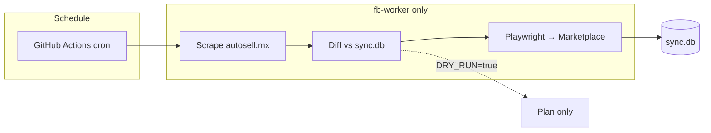
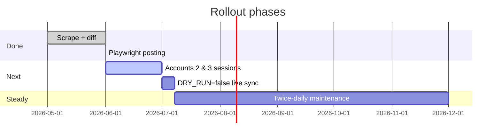

# Auto-upload

Sync [autosell.mx](https://www.autosell.mx) public catalog to Facebook Marketplace (Chihuahua, MX) across three personal accounts.

**Status:** Phase 0–1 (scrape + diff) and **Phase 2** (Facebook posting via Playwright) are implemented. Live scheduled posting stays off until `DRY_RUN=false` in GitHub Secrets. Manual test post verified on `account_1` (2020 Audi A3, `obj969`).

📖 **[Full project guide — diagrams, user stories, QA, statistics](./docs/PROJECT_GUIDE.md)** · **[Setup instructions](./SETUP.md)**

## At a glance

| | |
|--:|--|
| **Vehicles** | ~140 public catalog |
| **FB accounts** | 3 |
| **Target listings** | ~420 (140 × 3) |
| **Schedule** | 2× daily (Chihuahua) |
| **Posts/run/account** | 10 (configurable) |

## System overview



## Pipeline

| Job | Host | Action |
|-----|------|--------|
| **sync** | Self-hosted `fb-worker` | Scrape → diff → Facebook create/update/remove |

> GitHub cloud runners cannot reach autosell.mx (connect timeout). Register **fb-worker** before workflows run.

## Key scripts

| Script | Purpose |
|--------|---------|
| `run_sync.py` | Full sync (scrape + diff + FB when `DRY_RUN=false`) |
| `scripts/fb_login.py` | One-time headed login per account |
| `scripts/fb_test_session.py` | Verify saved session |
| `scripts/fb_post_test.py` | Post one vehicle (e.g. `--autosell-id obj969`) |
| `scripts/fb_find_listing.py` | Resolve listing URL from dashboard |

Facebook logic: `src/facebook/` (`poster.py`, `categorize.py`, `session.py`, `executor.py`).

## Quick start (local)

```bash
python3 -m venv .venv && source .venv/bin/activate
pip install -r requirements.txt
playwright install chromium
cp .env.example .env
python run_sync.py --dry-run
```

## Production setup

1. Push to GitHub and add secrets (see `.env.example`).
2. Register a self-hosted runner with label **`fb-worker`** (Oracle free VPS or Mac Mini).
3. Follow **[SETUP.md](./SETUP.md)** — sessions, test post, field mapping, enable live sync.
4. Review **[docs/PROJECT_GUIDE.md](./docs/PROJECT_GUIDE.md)** — architecture diagrams, QA checklist, rollout timeline.

Persistent state on fb-worker:

- `~/auto-upload-data/data/sync.db`
- `~/auto-upload-data/sessions/account_*`
- Working clone recommended at `~/auto-upload` (pull before manual tests)

## Rollout timeline


