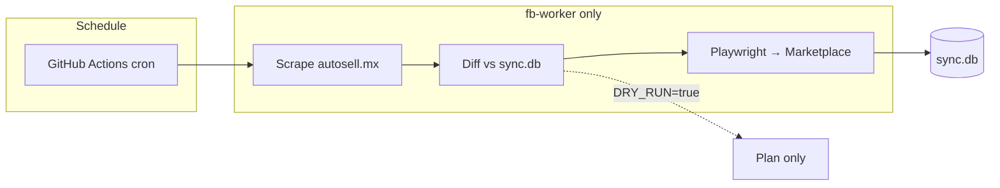
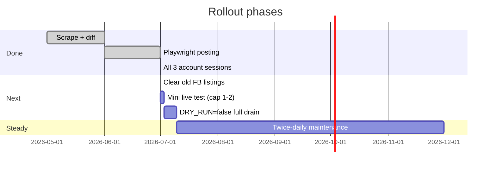

# Auto-upload

Sync [autosell.mx](https://www.autosell.mx) public catalog to Facebook Marketplace (Chihuahua, MX) across three personal accounts.

**Status:** Scrape, diff, and Playwright posting work. **Scheduled live sync is on** for **account_1** and **account_2** (`DRY_RUN=false`). **account_3** is excluded until old Marketplace listings are cleared there.

📖 **[Full project guide](./docs/PROJECT_GUIDE.md)** · **[Setup](./SETUP.md)**

## At a glance

| | |
|--:|--|
| **Vehicles** | ~140 public catalog |
| **FB accounts** | 3 (sessions on VM) |
| **Target listings** | ~420 (140 × 3) |
| **Schedule** | 2× daily (Chihuahua) |
| **Posts/run/account** | 10 (configurable) |
| **Live sync** | account_1 + account_2 (`DRY_RUN=false`) |

## System overview


```mermaid
flowchart LR
    subgraph Schedule
        GH[GitHub Actions cron]
    end
    subgraph Worker["fb-worker only"]
        SC[Scrape autosell.mx]
        DF[Diff vs sync.db]
        FB[Playwright → Marketplace]
    end
    GH --> SC --> DF --> FB
    DF -.->|DRY_RUN=true| LOG[Plan only]
    FB --> DB[(sync.db)]
```

The planner only manages listings **recorded in `sync.db`**. It does **not** scan Facebook’s “Your listings” for manual posts. Clear old inventory before go-live to avoid duplicates (see [PROJECT_GUIDE](./docs/PROJECT_GUIDE.md#go-live-checklist)).

## Pipeline

| Job | Host | Action |
|-----|------|--------|
| **sync** | Self-hosted `fb-worker` | Scrape → diff → create / update / remove on FB |

## Key scripts

| Script | Purpose |
|--------|---------|
| `run_sync.py` | Full sync (scrape + diff + FB when `DRY_RUN=false`) |
| `scripts/fb_login.py` | One-time headed login per account |
| `scripts/fb_test_session.py` | Verify saved session |
| `scripts/fb_post_test.py` | Post one vehicle (e.g. `--autosell-id obj969`) |
| `scripts/fb_find_listing.py` | Resolve listing URL from dashboard |
| `scripts/fb_debug_location.py` | Debug **Ubicación** combobox (account setup) |

Facebook logic: `src/facebook/` (`poster.py`, `categorize.py`, bilingual EN/ES labels; Can-Am/UTV → **Todoterreno** + free-text Marca). **Max 20 photos** per listing (Facebook limit; enforced in `photos.py`).

**Latest manual verification (account_3, es-MX):** `obj1126` Chevrolet Traverse LT (20 photos), `obj1125` Can-am Maverick XRC (15 photos).

## Quick start (local)

```bash
python3 -m venv .venv && source .venv/bin/activate
pip install -r requirements.txt
playwright install chromium
cp .env.example .env
python run_sync.py --dry-run
```

## Production setup

1. Push to GitHub and add secrets (see `.env.example`).
2. Register **`fb-worker`** (Oracle free VPS or Mac Mini).
3. Follow **[SETUP.md](./SETUP.md)** — sessions, Spanish/English form fields, go-live checklist.
4. Review **[docs/PROJECT_GUIDE.md](./docs/PROJECT_GUIDE.md)** — sync rules, planned work, mini live test (later).

Persistent state on fb-worker:

- `~/auto-upload-data/data/sync.db`
- `~/auto-upload-data/sessions/account_*` (lean copies without browser cache)
- Working clone: `~/auto-upload`

## Rollout timeline


```mermaid
gantt
    title Rollout phases
    dateFormat YYYY-MM
    section Done
        Scrape + diff           :done, p0, 2026-05, 2026-06
        Playwright posting      :done, p2, 2026-06, 2026-07
        All 3 account sessions  :done, p2b, 2026-07, 2026-07
    section Next
        Clear old FB listings   :active, p2c, 2026-07, 2026-07
        Mini live test (cap 1-2):p2d, after p2c, 2d
        DRY_RUN=false full drain:p2e, after p2d, 7d
    section Steady
        Twice-daily maintenance :p3, after p2e, 2026-12
```
