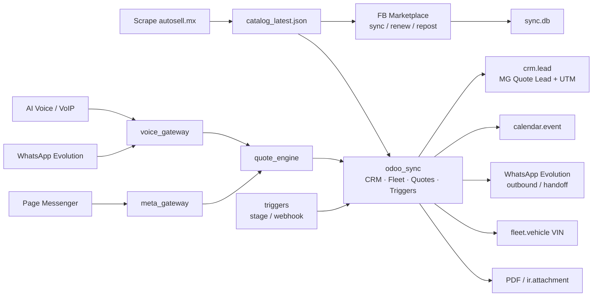
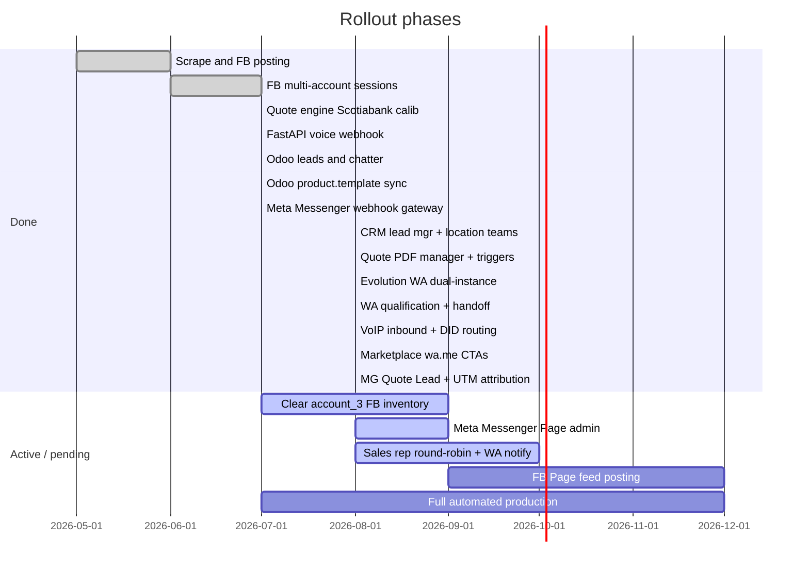

# Auto-upload

Sync [autosell.mx](https://www.autosell.mx) public catalog to **Facebook Marketplace** (Chihuahua, MX), ingest **AI Voice / WhatsApp / VoIP** leads via FastAPI, and keep **Odoo ERP** inventory (`product.template`) + CRM (`crm.lead`) in sync.

**Status:** see **[STATUS.md](./STATUS.md)** for the live checklist and roadmap.

- **AI Voice & lead webhook:** Live. FastAPI `POST /webhook/voice-lead` (also `/voice/webhook`, `/voice/stream`) → intent/STT → quote → Odoo lead (`MG Quote Lead` + UTM) + 24h follow-up → optional test-drive calendar → PDF → TTS text.
- **Inbound VoIP:** Live in code. `POST /voice/inbound` parses caller/DID → branch team (`ODOO_TEAM_*`) → CRM upsert + **Llamada Entrante** activity → TwiML/JSON forward.
- **WhatsApp (Evolution):** Live. Dual instances `autosell_periferico` / `autosell_san_felipe` → qualification state machine → Odoo handoff (`HANDOFF_TO_HUMAN`) + branch auto-reply.
- **Marketplace WhatsApp CTAs:** Live in description builder. Branch-mapped `wa.me` links appended to every FB listing text.
- **Meta Messenger webhook:** `[WIP - Paused awaiting Fanpage Administrator permissions]`. Code complete; Page token / webhook subscription pending Fanpage admin.
- **Scrape, diff & FB posting:** Live (`DRY_RUN=false`) for **account_1** and **account_2**. **account_3** excluded until old listings cleared.
- **Listing bump:** Daily incremental **full relist/repost** for listings ≥ **2 days** old (`scripts/run_weekly_bump.py`; 25 slots/account). Native Renovar optional via `--mode renew`.
- **Odoo inventory sync:** Live. Catalog → upsert `product.template` (`default_code = autosell_id`); website-missing SKUs marked **sold** then soft-archived (`active=False`).
- **CRM attribution:** Leads tagged **`MG Quote Lead`**; `medium_id` / `source_id` mapped by channel (WhatsApp Marketplace, Inbound Call, Autosell Web). Native Odoo WhatsApp templates remain **paused** (`ODOO_WA_ACCOUNT_*` unset).

📖 **[Full project guide](./docs/PROJECT_GUIDE.md)** · **[Setup](./SETUP.md)** · **[Status & roadmap](./STATUS.md)**

## At a glance

| | |
|--:|--|
| **AI Voice gateway** | FastAPI `POST /webhook/voice-lead`, `/voice/inbound` |
| **WhatsApp** | Evolution multi-instance + qualification bot (2 branches) |
| **Meta Messenger** | WIP paused — code done; awaiting Fanpage admin / Page token |
| **Quote engine** | Local French Amortization (Scotiabank profile) |
| **Vehicles** | ~130–134 public catalog from `autosell.mx` |
| **FB accounts** | 3 sessions; **2 live** (`account_1`, `account_2`) |
| **Target FB listings** | ~268 (134 × 2 active accounts) |
| **Odoo CRM** | `MG Quote Lead` tag + UTM medium/source; branch teams |
| **Schedule** | 2× daily scrape + Odoo sync + FB sync; daily relist (≥3d age) |

## System overview


```mermaid
flowchart LR
    SC["Scrape autosell.mx"]
    SNAP["catalog_latest.json"]
    FB["FB Marketplace<br/>sync / renew / repost"]
    DB["sync.db"]
    CALLER["AI Voice / VoIP"]
    WA_IN["WhatsApp Evolution"]
    VG["voice_gateway"]
    QE["quote_engine"]
    ODOO["odoo_sync<br/>CRM · Fleet · Quotes · Triggers"]
    LEAD["crm.lead<br/>MG Quote Lead + UTM"]
    CAL["calendar.event"]
    WA["WhatsApp Evolution<br/>outbound / handoff"]
    FLEET["fleet.vehicle VIN"]
    PDF["PDF / ir.attachment"]
    MSG["Page Messenger"]
    META["meta_gateway"]
    TRG["triggers<br/>stage / webhook"]

    SC --> SNAP
    SNAP --> FB
    FB --> DB
    SNAP --> ODOO
    CALLER --> VG
    WA_IN --> VG
    VG --> QE
    QE --> ODOO
    TRG --> ODOO
    ODOO --> LEAD
    ODOO --> CAL
    ODOO --> WA
    ODOO --> FLEET
    ODOO --> PDF
    MSG --> META
    META --> QE
```

**Automated path:** FB reposter (catalog + bump) ➔ Voice / WhatsApp / form / stage webhooks ➔ local quote math ➔ `CRMLeadManager` (dedupe + branch/location team + UTM) ➔ fleet VIN ➔ `QuotePDFManager` on stage `quoted`/`cotizado` ➔ WhatsApp via Evolution (native Odoo templates still queued until Meta Cloud API).

Voice / WhatsApp / Meta inbound and catalog / FB Marketplace paths share Odoo inventory but keep separate browser sessions. Quote math runs locally before any Odoo / WhatsApp / Messenger payload.

The FB planner only manages listings in **`sync.db`**. It does not scan Facebook’s “Your listings”. Clear old inventory before enabling new accounts (see [PROJECT_GUIDE](./docs/PROJECT_GUIDE.md#go-live-checklist)).

## Pipeline

| Job | Host | Action |
|-----|------|--------|
| **Voice / form webhook** | API host | Quote → `CRMLeadManager` / pipeline → fleet VIN → PDF; stage triggers may queue WA |
| **WhatsApp inbound** | API host `:8080` | Evolution `messages.upsert` → qualification → Odoo + branch reply |
| **VoIP inbound** | API host | `POST /voice/inbound` → DID→branch → CRM + TwiML dial |
| **Odoo stage trigger** | API / worker | Stage `quoted`/`cotizado` → attach quote PDF → **queue** native WA (Meta paused) |
| **Meta webhook** | API host | Messenger event → quote → Odoo lead/chatter → Graph API reply |
| **Catalog scrape** | GitHub Actions / `fb-worker` | `autosell.mx` → `catalog_latest.json` |
| **Odoo inventory** | CI step / `fb-worker` | `sync_odoo_inventory.py` → upsert `product.template` |
| **FB sync** | Self-hosted `fb-worker` | Diff → create / update / remove on active accounts |
| **Repost / relist** | Daily cron / `fb-worker` | Listings ≥3d: mark sold → create new URL (default). Optional `--mode renew` |

## Key scripts

### Voice, WhatsApp, quote & Odoo

| Path | Purpose |
|------|---------|
| `src/voice_gateway/webhook.py` | FastAPI app: voice, WhatsApp, Meta, `/voice/inbound` |
| `src/voice_gateway/inbound_call.py` | VoIP parse, DID→branch, TwiML/JSON, rep alert after call log |
| `src/whatsapp_worker/` | Evolution client, inbound parse, qualification FSM, branch routing |
| `src/whatsapp_worker/webhook.py` | Standalone inbound WhatsApp receiver (own process) |
| `src/config.py` | Branch rep rosters (`REPS_*`), `DEFAULT_REP_PHONE`, tag→branch map |
| `src/notifications/whatsapp_rep.py` | 1-on-1 WhatsApp handoff card to the assigned rep |
| `src/meta_gateway/` | Messenger parse, quote orchestration, Graph API reply |
| `src/pipeline.py` | End-to-end lead: trade-in → quote → Odoo → PDF → WhatsApp |
| `src/quote_engine/` | Local amortization + Scotiabank profile |
| `src/odoo_sync/` | Modular Odoo XML-RPC (see below) |
| `src/facebook/listing_cta.py` | Branch `wa.me` CTAs in Marketplace descriptions |
| `src/pdf_engine/` | ReportLab quote / vehicle spec PDF (+ optional Odoo `ir.attachment`) |
| `scripts/sync_odoo_inventory.py` | Upsert catalog into `product.template` |
| `scripts/test_live_odoo.py` | Live Odoo smoke (lead + chatter) |
| `scripts/inspect_odoo_inventory.py` | Audit Odoo vehicle products |

### `src/odoo_sync/` modules

| File | Role |
|------|------|
| `base.py` | Shared `OdooClient` session (`authenticate`, `execute_kw`, `ODOO_DRY_RUN`) |
| `client.py` | `OdooCRMClient` — CRM leads (`MG Quote Lead` + UTM), inventory, calendar, activities |
| `crm.py` | **`CRMLeadManager`** — dict upsert, phone dedupe + chatter, `ODOO_TEAM_*`, fleet location → team, channel UTM. Also **`RoundRobinAssigner`** / `assign_lead_owner` |
| `quotes.py` | **`QuotePDFManager`** — branch-branded PDF (ReportLab or fallback) + attach to lead chatter |
| `triggers.py` | **`OdooTriggerManager`** / **`process_incoming_webhook`** — stage `quoted`/`cotizado` → PDF + WA queue; inbound forms/voice → CRM |
| `whatsapp.py` | Native Odoo WhatsApp templates. **PAUSED:** Meta Manager pending — leave `ODOO_WA_ACCOUNT_*` unset |
| `fleet.py` | `fleet.vehicle` by VIN/plate → lead; location fields for physical-site routing |
| `documents.py` | `attach_document_to_lead` / `attach_file` via `ir.attachment` |

**CRM UTM map:** WhatsApp → medium `WhatsApp` / source `Facebook Marketplace`; Voice → `Phone` / `Inbound Call`; Web → `Website` / `Autosell Web`.

### Lead routing (round-robin → rep WhatsApp)

Rosters are JSON env, read fresh on every pick, so a rep change needs no restart:

```bash
REPS_PERIFERICO='[{"odoo_id": 2, "phone": "+526141234567", "name": "Ana"}]'
REPS_SAN_FELIPE='[{"odoo_id": 5, "phone": "+526149876543"}]'
DEFAULT_REP_PHONE='+526141234567'   # used when a branch has no rep
REP_NOTIFY_ENABLED=true             # false mutes the rep card
```

- Branch comes from the catalog tag: `*` Periférico, `+` San Felipe, `-` consignment (Periférico desk).
- Rotation is per branch, modulo the current roster length; fallback order is branch roster → Periférico roster → `DEFAULT_REP_PHONE` → unassigned (warned, never raises).
- Fires on WhatsApp `HANDOFF_TO_HUMAN` (transition turn only, so follow-ups don't re-alert) and after `/voice/inbound` logs the call. A failed rep alert never breaks the customer conversation.

**Webhook routes:** `/webhook/odoo` (+ `/odoo/webhook` alias) mounts `process_incoming_webhook`; `/webhook/whatsapp` exists both on the voice gateway and on the standalone worker (`uvicorn src.whatsapp_worker.webhook:app`).

```bash
# Odoo automation dry-run (no live XML-RPC)
python - <<'PY'
from src.odoo_sync import process_incoming_webhook, OdooTriggerManager
print(process_incoming_webhook({
    "event": "lead_form",
    "client_name": "Ana",
    "phone": "6141234567",
    "vehicle_info": "CX-5",
    "trigger_quote": True,
}, dry_run=True))
PY
python -m unittest tests.test_crm_leads tests.test_quotes tests.test_triggers -q
```

### Facebook Marketplace

| Script | Purpose |
|--------|---------|
| `run_sync.py` | Full sync (scrape + diff + FB; `sync.active_accounts`) |
| `scripts/run_renew.py` | **Renovar** (same URL) |
| `scripts/run_repost.py` | Full repost (sold → create → new URL) |
| `scripts/run_weekly_bump.py` | Listing bump (default **repost/relist**; optional renew) |
| `scripts/fb_repost_hold.py` | Skip renew/repost during FB ads |
| `scripts/fb_login.py` | Headed login per account |
| `scripts/fb_test_session.py` | Verify session |
| `scripts/fb_post_test.py` | Post one vehicle (`--autosell-id obj969`) |
| `scripts/cleanup_logs.py` | Delete debug PNGs / temp logs past retention |

Facebook logic: `src/facebook/` (`poster.py`, `categorize.py`, `listing_cta.py`, bilingual EN/ES). **Max 20 photos** per listing. Descriptions include autosell.mx URL + branch WhatsApp CTA.

## Operations

### Catalog ingestion

`run_weekly_bump.py --all-eligible` scrapes autosell.mx, pushes inventory to Odoo when `ODOO_URL` + `ODOO_DB` are set, then syncs Facebook. Each run prints the branch-tag breakdown (`* periferico=41  + san_felipe=33  - consignment=18  untagged=…`) so tag retention is visible. `--skip-scrape` / `SKIP_SCRAPE` reuses `data/catalog_latest.json`; `--skip-odoo` / `SKIP_ODOO` bypasses XML-RPC entirely.

### Session health pre-check

`src/facebook/health.py` runs before any Playwright loop: an offline check of the Chromium profile, then one live Marketplace load per healthy account that classifies `ok` / `logged_out` / `checkpoint`. Skipped on `--dry-run`; set `FB_SESSION_PRECHECK_LIVE=false` to keep only the offline check. A failure fixes with `python scripts/fb_login.py --account <id>` (headed, on fb-worker).

### Failure alerts

`src/alerts.py` fans one message out to Telegram (`TELEGRAM_BOT_TOKEN` + `TELEGRAM_CHAT_ID`) and Slack (`SLACK_WEBHOOK_URL`); stdlib only, never raises, never logs tokens. `run_repost.py` alerts when the session pre-check fails and when a run ends with hard errors or expired sessions. With nothing configured it reports `no alert channel configured` and continues. `ALERTS_ENABLED=false` mutes it.

### Log rotation

`scripts/cleanup_logs.py` deletes `data/logs/facebook/*.png` and `/tmp/*.log` older than `LOG_RETENTION_DAYS` (default 7), skipping directories, symlinks, and files owned by other users. It runs automatically after each non-dry bump (`--no-cleanup-logs` opts out) and as an `always()` CI step.

```bash
python scripts/cleanup_logs.py --dry-run --verbose
python scripts/cleanup_logs.py --max-age-days 3 --target data/logs/facebook:'*.png'
```

## Tests

CI (`.github/workflows/test.yml`) and local runs use the stdlib runner — **`pytest` is not a dependency**, so keep new tests on `unittest.TestCase`:

```bash
python -m unittest discover -s src -p 'test_*.py'
python -m unittest discover -s tests -p 'test_*.py'
```

Tests live beside the code in `src/**/test_*.py` (parsing, session health, alerts, cleanup, gateways) and as integration-flavored suites in `tests/` (`test_crm_leads.py`, `test_quotes.py`, `test_triggers.py`, `test_odoo_extensions.py`, `test_crm_round_robin.py`, `test_whatsapp_rep.py`). Nothing here touches live Facebook, Odoo, or WhatsApp.

## Quick start (local)

```bash
python3 -m venv .venv && source .venv/bin/activate
pip install -r requirements.txt
playwright install chromium
cp .env.example .env

# Dry-run FB sync
python run_sync.py --dry-run

# Live Odoo smoke + inventory from snapshot
python scripts/test_live_odoo.py
python scripts/sync_odoo_inventory.py --from-snapshot data/snapshots/catalog_latest.json

# Voice + WhatsApp + Meta webhooks (dev)
uvicorn src.voice_gateway.webhook:app --reload --host 0.0.0.0 --port 8080
# WhatsApp: POST /webhook/whatsapp
# VoIP:     POST /voice/inbound
# Meta:     GET/POST /webhook/facebook  (needs FB_VERIFY_TOKEN, FB_PAGE_ACCESS_TOKEN)
```

## Production setup

1. Push to GitHub; add secrets below (also in `.env.example`).
2. Register **`fb-worker`** (Oracle free VPS or Mac Mini).
3. Follow **[SETUP.md](./SETUP.md)** — sessions, form fields, go-live.
4. Review **[docs/PROJECT_GUIDE.md](./docs/PROJECT_GUIDE.md)** — sync rules, Phase 2 architecture.
5. Evolution API + webhook: `deploy/docker-compose.evolution.yml`, `deploy/autosell-webhook.service`.

### Required GitHub Actions secrets (`sync.yml`)

| Secret | Purpose |
|--------|---------|
| `DRY_RUN` | `false` for live FB posts |
| `AUTOSELL_BASE_URL` | Optional; default `https://www.autosell.mx` |
| `ODOO_URL` | e.g. `https://autosellmx.odoo.com` |
| `ODOO_DB` | e.g. `autosellmx` |
| `ODOO_USER` | XML-RPC login. Alias: `ODOO_USERNAME` |
| `ODOO_PASSWORD` | API key/password. Alias: `ODOO_API_KEY` |

Optional in `repost.yml`: `SLACK_WEBHOOK_URL` / `TELEGRAM_BOT_TOKEN` + `TELEGRAM_CHAT_ID` (failure alerts), `FB_SESSION_PRECHECK_LIVE`, `LOG_RETENTION_DAYS`.

Webhook runtime (API host `.env`, not sync.yml): `FB_VERIFY_TOKEN`, `FB_PAGE_ACCESS_TOKEN`, `WHATSAPP_*` / Evolution, `ODOO_TEAM_PERIFERICO` / `ODOO_TEAM_SAN_FELIPE`, `REPS_PERIFERICO` / `REPS_SAN_FELIPE` / `DEFAULT_REP_PHONE`, optional `VOICE_DID_*` / `VOICE_FORWARD_*`, `META_DEFAULT_BRANCH_ID` / `VOICE_DEFAULT_BRANCH_ID`.

After each scrape, CI runs `scripts/sync_odoo_inventory.py` on `data/snapshots/catalog_latest.json`.

Active accounts: **`config.yaml`** → `sync.active_accounts` (`account_1`, `account_2`). Override with `--accounts` or `SYNC_ACCOUNTS`.

Persistent state on fb-worker:

- `~/auto-upload-data/data/sync.db`
- `~/auto-upload-data/sessions/account_*`
- Working clone: `~/auto-upload`

## Rollout timeline


```mermaid
gantt
    title Rollout phases
    dateFormat YYYY-MM
    section Done
        Scrape and FB posting             :done, p0, 2026-05, 2026-06
        FB multi-account sessions         :done, p1, 2026-06, 2026-07
        Quote engine Scotiabank calib     :done, p2a, 2026-07, 2026-07
        FastAPI voice webhook             :done, p2b, 2026-07, 2026-07
        Odoo leads and chatter            :done, p2c, 2026-07, 2026-07
        Odoo product.template sync        :done, p2d, 2026-07, 2026-07
        Meta Messenger webhook gateway    :done, p2e, 2026-07, 2026-07
        CRM lead mgr + location teams     :done, p2f, 2026-08, 2026-08
        Quote PDF manager + triggers      :done, p2g, 2026-08, 2026-08
        Evolution WA dual-instance        :done, p2h, 2026-08, 2026-08
        WA qualification + handoff        :done, p2i, 2026-08, 2026-08
        VoIP inbound + DID routing        :done, p2j, 2026-08, 2026-08
        Marketplace wa.me CTAs            :done, p2k, 2026-08, 2026-08
        MG Quote Lead + UTM attribution   :done, p2l, 2026-08, 2026-08
    section Active / pending
        Clear account_3 FB inventory      :active, p3a, 2026-07, 2026-09
        Meta Messenger Page admin         :active, p3m, 2026-08, 2026-09
        Sales rep round-robin + WA notify :active, p3rr, 2026-08, 2026-10
        FB Page feed posting              :p3feed, 2026-09, 2026-12
        Full automated production         :p3b, 2026-07, 2026-12
```
