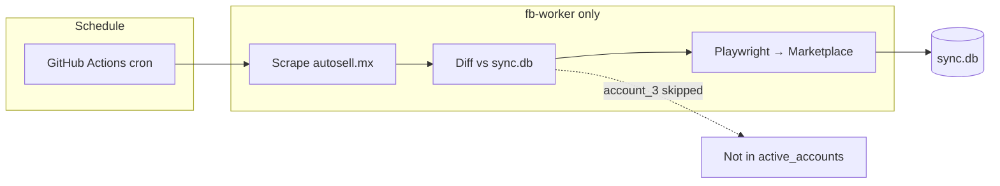
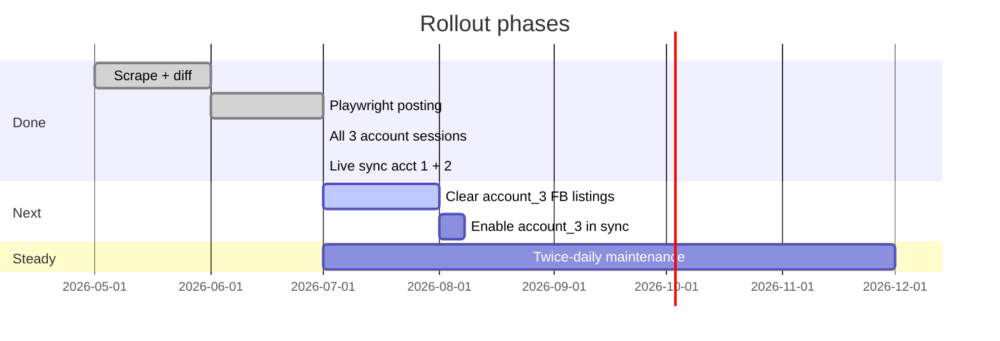

# Auto-upload

Sync [autosell.mx](https://www.autosell.mx) public catalog to Facebook Marketplace (Chihuahua, MX) across three personal accounts.

**Status:** Scrape, diff, and Playwright posting work. **Scheduled live sync is on** for **account_1** and **account_2** (`DRY_RUN=false`). **account_3** is excluded until old Marketplace listings are cleared there.

📖 **[Full project guide](./docs/PROJECT_GUIDE.md)** · **[Setup](./SETUP.md)**

## At a glance

| | |
|--:|--|
| **Vehicles** | ~134 public catalog |
| **FB accounts** | 3 sessions; **2 live** (account_1, account_2) |
| **Target listings (live)** | ~268 (134 × 2 active accounts) |
| **Schedule** | 2× daily sync + **weekly repost** (Sun 09:00 Chihuahua) |
| **Posts/run/account** | 10 (configurable) |
| **Live sync** | account_1 + account_2 (`DRY_RUN=false`) |
| **account_3** | Excluded until old listings cleared |

## System overview


```mermaid
flowchart LR
    subgraph Schedule
        GH[GitHub Actions cron]
    end
    subgraph Worker["fb-worker only"]
        SC[Scrape autosell.mx]
        DF[Diff vs sync.db]
        FB[Playwright → Marketplace]
    end
    GH --> SC --> DF --> FB
    DF -.->|account_3 skipped| SKIP[Not in active_accounts]
    FB --> DB[(sync.db)]
```

The planner only manages listings **recorded in `sync.db`**. It does **not** scan Facebook’s “Your listings” for manual posts. Clear old inventory before go-live to avoid duplicates (see [PROJECT_GUIDE](./docs/PROJECT_GUIDE.md#go-live-checklist)).

## Pipeline

| Job | Host | Action |
|-----|------|--------|
| **sync** | Self-hosted `fb-worker` | Scrape → diff → create / update / remove on FB |
| **repost** | Self-hosted `fb-worker` | Weekly repost eligible listings (account_1 + account_2) |

## Key scripts

| Script | Purpose |
|--------|---------|
| `run_sync.py` | Full sync (scrape + diff + FB when `DRY_RUN=false`; respects `sync.active_accounts`) |
| `scripts/run_repost.py` | Repost listings (mark sold → create → refresh URL in sync.db) |
| `scripts/fb_repost_hold.py` | Add/clear/list repost holds (ads, promotions) |
| `scripts/fb_login.py` | One-time headed login per account |
| `scripts/fb_test_session.py` | Verify saved session |
| `scripts/fb_post_test.py` | Post one vehicle (e.g. `--autosell-id obj969`) |
| `scripts/fb_find_listing.py` | Resolve listing URL from dashboard |
| `scripts/fb_debug_location.py` | Debug **Ubicación** combobox (account setup) |

Facebook logic: `src/facebook/` (`poster.py`, `categorize.py`, bilingual EN/ES labels; Can-Am/UTV → **Todoterreno** + free-text Marca; **Shelby → Ford** in Marca dropdown with model `Shelby Cobra`). **Max 20 photos** per listing (Facebook limit; enforced in `photos.py`).

**Live status (Jul 2026):** account_1 and account_2 fully synced (134/134 each). account_3 session valid; not in scheduled sync until operator clears old FB inventory.

## Quick start (local)

```bash
python3 -m venv .venv && source .venv/bin/activate
pip install -r requirements.txt
playwright install chromium
cp .env.example .env
python run_sync.py --dry-run
```

## Production setup

1. Push to GitHub and add secrets (see `.env.example`).
2. Register **`fb-worker`** (Oracle free VPS or Mac Mini).
3. Follow **[SETUP.md](./SETUP.md)** — sessions, Spanish/English form fields, go-live checklist.
4. Review **[docs/PROJECT_GUIDE.md](./docs/PROJECT_GUIDE.md)** — sync rules, account scoping, steady-state ops.

Active accounts are set in **`config.yaml`** → `sync.active_accounts` (currently `account_1`, `account_2`). Override per run with `--accounts` or `SYNC_ACCOUNTS` env.

Persistent state on fb-worker:

- `~/auto-upload-data/data/sync.db`
- `~/auto-upload-data/sessions/account_*` (lean copies without browser cache)
- Working clone: `~/auto-upload`

## Rollout timeline


```mermaid
gantt
    title Rollout phases
    dateFormat YYYY-MM
    section Done
        Scrape + diff           :done, p0, 2026-05, 2026-06
        Playwright posting      :done, p2, 2026-06, 2026-07
        All 3 account sessions  :done, p2b, 2026-07, 2026-07
        Live sync acct 1 + 2    :done, p2e, 2026-07, 2026-07
    section Next
        Clear account_3 FB listings :active, p2c, 2026-07, 2026-08
        Enable account_3 in sync  :p2f, after p2c, 7d
    section Steady
        Twice-daily maintenance :p3, 2026-07, 2026-12
```
