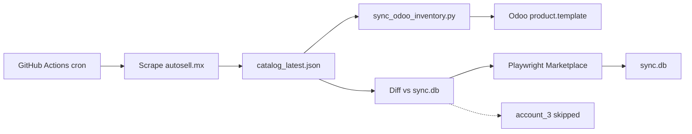
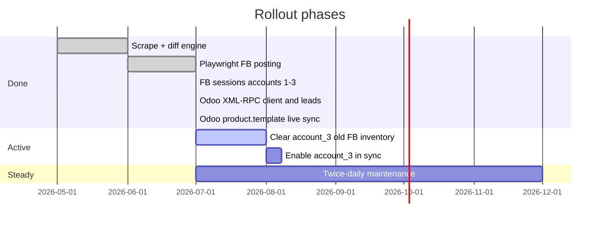

# Auto-upload

Sync [autosell.mx](https://www.autosell.mx) public catalog to **Facebook Marketplace** (Chihuahua, MX) across multiple personal accounts, and keep **Odoo ERP** vehicle inventory (`product.template`) updated with live MXN prices.

**Status:**

- **Scrape, diff & FB posting:** Live (`DRY_RUN=false`) for **account_1** and **account_2**. **account_3** excluded until old Marketplace listings are cleared.
- **Odoo inventory sync:** Live. Catalog scrape → upsert `product.template` via XML-RPC (`default_code = autosell_id`).

📖 **[Full project guide](./docs/PROJECT_GUIDE.md)** · **[Setup](./SETUP.md)**

## At a glance

| | |
|--:|--|
| **Vehicles** | ~130–134 public catalog from `autosell.mx` |
| **FB accounts** | 3 sessions; **2 live** (`account_1`, `account_2`) |
| **Target FB listings** | ~268 (134 × 2 active accounts) |
| **Odoo** | XML-RPC → `product.template` (category `vehiculos`) |
| **Schedule** | 2× daily scrape + Odoo sync + FB sync; **weekly renew** (Sun 09:00 Chihuahua) |
| **Posts/run/account** | 10 (configurable) |
| **Live** | account_1 + account_2 + Odoo (`DRY_RUN=false`) |

## System overview


```mermaid
flowchart LR
    GH["GitHub Actions cron"]
    SC["Scrape autosell.mx"]
    SNAP["catalog_latest.json"]
    ODOO["sync_odoo_inventory.py"]
    ERP["Odoo product.template"]
    DF["Diff vs sync.db"]
    FB["Playwright Marketplace"]
    DB["sync.db"]
    SKIP["account_3 skipped"]

    GH --> SC
    SC --> SNAP
    SNAP --> ODOO
    ODOO --> ERP
    SNAP --> DF
    DF --> FB
    FB --> DB
    DF -.-> SKIP
```

Scrape, Odoo upsert, diff, and FB posting run on the self-hosted **`fb-worker`**.

The planner only manages listings **recorded in `sync.db`**. It does **not** scan Facebook’s “Your listings” for manual posts. Clear old inventory before enabling new accounts (see [PROJECT_GUIDE](./docs/PROJECT_GUIDE.md#go-live-checklist)).

## Pipeline

| Job | Host | Action |
|-----|------|--------|
| **Catalog scrape** | GitHub Actions / `fb-worker` | Fetch `autosell.mx` → `catalog_latest.json` |
| **Odoo sync** | CI step / `fb-worker` | `sync_odoo_inventory.py` → upsert `product.template` |
| **FB sync** | Self-hosted `fb-worker` | Diff → create / update / remove on active accounts |
| **Repost / renew** | Weekly cron / `fb-worker` | **Renovar** (same URL); optional full repost via CLI |

## Key scripts

### Odoo

| Script / module | Purpose |
|-----------------|---------|
| `scripts/sync_odoo_inventory.py` | Upsert vehicles into `product.template` (`default_code` = `autosell_id`) |
| `src/odoo_sync/client.py` | XML-RPC client: auth, leads, chatter, inventory |
| `scripts/test_live_odoo.py` | Live Odoo smoke test (lead + chatter) |
| `scripts/inspect_odoo_inventory.py` | List / audit Odoo vehicle products |

### Facebook Marketplace

| Script | Purpose |
|--------|---------|
| `run_sync.py` | Full sync (scrape + diff + FB; respects `sync.active_accounts`) |
| `scripts/run_renew.py` | **Renovar** (same URL, bump) — weekly default |
| `scripts/run_repost.py` | Full repost (mark sold → create → new URL) |
| `scripts/fb_repost_hold.py` | Holds — skip renew/repost during FB ads |
| `scripts/fb_set_listing_url.py` | Fix sync.db URL after Chrome extension |
| `scripts/fb_login.py` | One-time headed login per account |
| `scripts/fb_test_session.py` | Verify saved session |
| `scripts/fb_post_test.py` | Post one vehicle (e.g. `--autosell-id obj969`) |
| `scripts/fb_find_listing.py` | Resolve listing URL from dashboard |
| `scripts/fb_debug_location.py` | Debug **Ubicación** combobox |

Facebook logic: `src/facebook/` (`poster.py`, `categorize.py`, bilingual EN/ES; Can-Am/UTV → **Todoterreno**; **Shelby → Ford** + model `Shelby Cobra`). **Max 20 photos** per listing (`photos.py`).

## Quick start (local)

```bash
python3 -m venv .venv && source .venv/bin/activate
pip install -r requirements.txt
playwright install chromium
cp .env.example .env

# Dry-run FB sync
python run_sync.py --dry-run

# Live Odoo smoke + inventory sync from snapshot
python scripts/test_live_odoo.py
python scripts/sync_odoo_inventory.py --from-snapshot data/snapshots/catalog_latest.json
```

## Production setup

1. Push to GitHub and add secrets (see below / `.env.example`).
2. Register **`fb-worker`** (Oracle free VPS or Mac Mini).
3. Follow **[SETUP.md](./SETUP.md)** — sessions, Spanish/English form fields, go-live checklist.
4. Review **[docs/PROJECT_GUIDE.md](./docs/PROJECT_GUIDE.md)** — sync rules, account scoping, steady-state ops.

### Required GitHub Actions secrets (`sync.yml`)

| Secret | Purpose |
|--------|---------|
| `DRY_RUN` | `false` for live FB posts |
| `AUTOSELL_BASE_URL` | Optional override (default `https://www.autosell.mx`) |
| `ODOO_URL` | Odoo host, e.g. `https://autosellmx.odoo.com` |
| `ODOO_DB` | Database name, e.g. `autosellmx` |
| `ODOO_USER` | XML-RPC login (email). Alias: `ODOO_USERNAME` |
| `ODOO_PASSWORD` | API key or password. Alias: `ODOO_API_KEY` |

After each scrape, CI runs `scripts/sync_odoo_inventory.py` against `data/snapshots/catalog_latest.json`.

Active accounts: **`config.yaml`** → `sync.active_accounts` (currently `account_1`, `account_2`). Override with `--accounts` or `SYNC_ACCOUNTS`.

Persistent state on fb-worker:

- `~/auto-upload-data/data/sync.db`
- `~/auto-upload-data/sessions/account_*`
- Working clone: `~/auto-upload`

## Rollout timeline


```mermaid
gantt
    title Rollout phases
    dateFormat YYYY-MM
    section Done
        Scrape + diff engine              :done, p0, 2026-05, 2026-06
        Playwright FB posting             :done, p2, 2026-06, 2026-07
        FB sessions accounts 1-3          :done, p2b, 2026-07, 2026-07
        Odoo XML-RPC client and leads     :done, p2c, 2026-07, 2026-07
        Odoo product.template live sync   :done, p2d, 2026-07, 2026-07
    section Active
        Clear account_3 old FB inventory  :active, p2e, 2026-07, 2026-08
        Enable account_3 in sync          :p2f, after p2e, 7d
    section Steady
        Twice-daily maintenance           :p3, 2026-07, 2026-12
```
