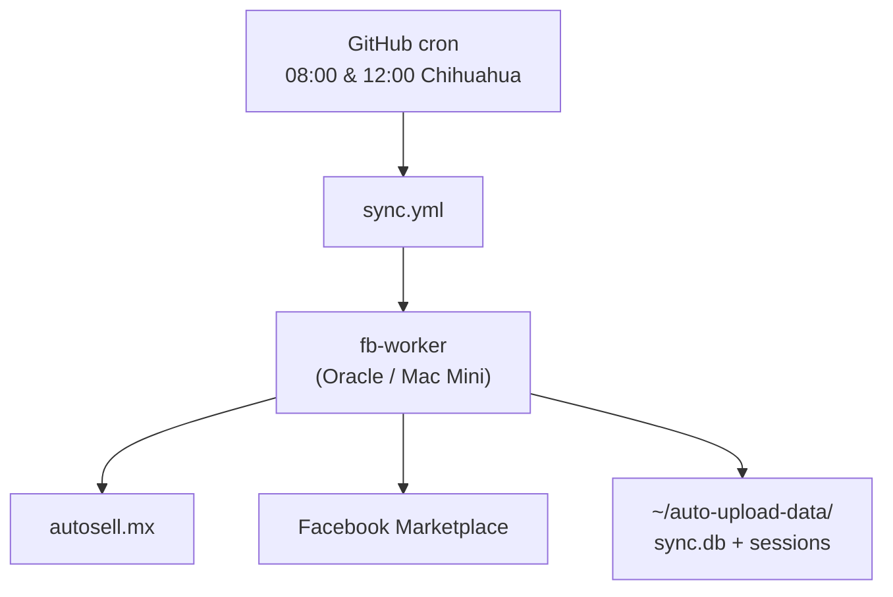
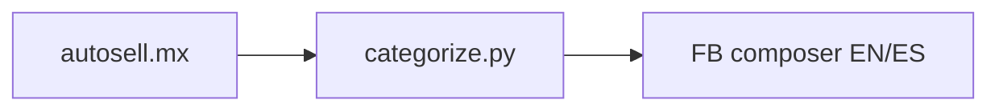
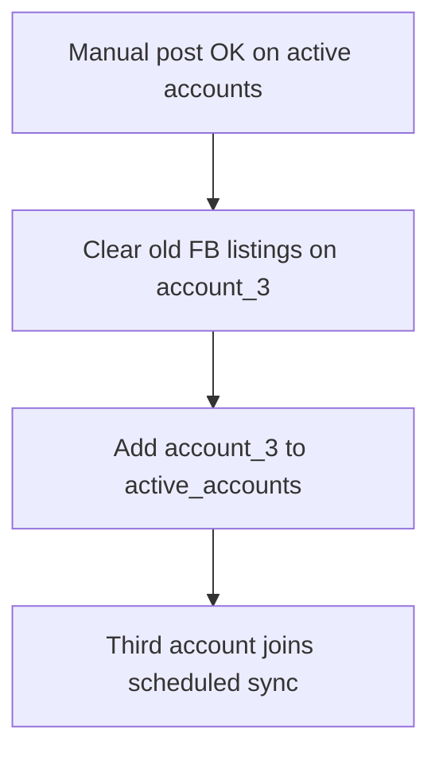

# Setup: GitHub + fb-worker (Oracle VPS or Mac Mini)

# Split architecture (updated)

**Important:** autosell.mx does **not** respond to GitHub cloud runner IPs (connect timeout). Scrape and Facebook both run on **fb-worker** — not `ubuntu-latest`.

| Step | Host | Does |
|------|------|------|
| **sync** job | **fb-worker** | Scrape → diff → (Phase 2) Facebook |

Your daily PC can stay off. Only **fb-worker** must be always on and registered before workflows can run.

Phase 0–1: scrape + diff. **Phase 2 (Facebook):** Playwright posting works on **all three accounts** (English and Spanish Marketplace UI). Sessions are on fb-worker.

**Live sync is on** for **account_1** and **account_2** (`DRY_RUN=false`, GitHub secret set). **account_3** is excluded via `config.yaml` → `sync.active_accounts` until that operator clears old Marketplace listings.

**Extended docs:** [docs/PROJECT_GUIDE.md](./docs/PROJECT_GUIDE.md) — sync rules, go-live checklist, planned work, diagrams.

---

## Where data lives

| Path | Location | In git? |
|------|----------|---------|
| `data/catalog_latest.json` | Written on fb-worker each run; optional GitHub artifact | No |
| `data/sync.db` | **`~/auto-upload-data/data/` on fb-worker** | No |
| `sessions/account_*` | **`~/auto-upload-data/sessions/` on fb-worker** | No |
| `data/logs/facebook/` | Debug screenshots on fb-worker (`obj969_*.png`, etc.) | No |

The scrape step must run on fb-worker because autosell.mx blocks GitHub-hosted datacenter IPs.

The workflow symlinks `data/` and `sessions/` to `~/auto-upload-data/` so `sync.db` survives each checkout.

---

## Choose your fb-worker

| Option | Cost | Best for |
|--------|------|----------|
| **[Oracle Cloud Always Free](https://www.oracle.com/cloud/free/)** (ARM, 2 OCPU / 12 GB) | $0 | No Mac Mini yet; pick Mexico Central or Monterrey at signup |
| **Mac Mini** (M1/M2, 8–16 GB RAM) | power only | Best Facebook experience (home/residential IP) |
| **Hetzner / DO / Vultr** | ~$5–6/mo | If Oracle capacity fails |

**Not suitable:** Hugging Face Spaces, Streamlit Cloud, Render/Railway free tiers — they sleep and cannot keep Facebook browser sessions.

**Scheduling:** GitHub Actions cron triggers sync (2× daily) and repost (weekly Sunday). You do not need cron on the worker itself.

| Workflow | Schedule (Chihuahua) | Purpose |
|----------|----------------------|---------|
| `sync.yml` | 08:00 & 12:00 daily | New cars, price updates, removals |
| `repost.yml` | **Sunday 09:00** | Refresh listing placement (respects holds) |

---

## Architecture



ASCII (minimal):

```
GitHub schedule → sync job → fb-worker → scrape autosell.mx → diff → Playwright (Phase 2)
```

If fb-worker is offline: workflow queues or fails (GitHub emails you).

See also: [CI/CD flowchart](./docs/PROJECT_GUIDE.md#end-to-end-sync-flow) · [FB posting flowchart](./docs/PROJECT_GUIDE.md#facebook-create-listing-flow-playwright)

---

## Part A — GitHub secrets

**Settings → Secrets and variables → Actions**

| Secret | Example | Used by |
|--------|---------|---------|
| `AUTOSELL_BASE_URL` | `https://www.autosell.mx` | sync job |
| `DRY_RUN` | `false` (live) | sync job — set `true` to plan only |
| `MAX_POSTS_PER_ACCOUNT_PER_RUN` | `10` | sync job |
| `SYNC_ACCOUNTS` | optional `account_1,account_2` | overrides `config.yaml` `active_accounts` |
| `TELEGRAM_BOT_TOKEN` | optional | sync job |
| `TELEGRAM_CHAT_ID` | optional | sync job |

**Account scoping:** By default, only accounts listed in **`config.yaml`** → `sync.active_accounts` are synced. Currently `account_1` and `account_2`. Do not add `account_3` until old FB listings are cleared on that account.

Local dev: `cp .env.example .env`

---

## Part B — Oracle Linux VPS (free fb-worker)

### B1. Create VM

1. [Oracle Cloud Free Tier](https://www.oracle.com/cloud/free/) signup (card required, stay in Always Free limits).
2. Home region: **Mexico Central** or **Mexico Northeast**.
3. Shape **VM.Standard.A1.Flex**: **2 OCPU**, **12 GB RAM**, Ubuntu 22.04 **ARM**, 50 GB disk.
4. “Out of host capacity” → retry another availability domain or off-peak hours.

```bash
ssh ubuntu@YOUR_VPS_IP
sudo apt update && sudo apt upgrade -y
sudo apt install -y git curl python3 python3-pip python3-venv
mkdir -p ~/auto-upload-data/data/snapshots ~/auto-upload-data/sessions
```

### B2. Register runner (label `fb-worker`)

GitHub → **Settings → Actions → Runners → New self-hosted runner → Linux → ARM64**

```bash
mkdir -p ~/actions-runner && cd ~/actions-runner
# Download + extract using commands from GitHub UI

./config.sh \
  --url https://github.com/YOUR_USER/YOUR_REPO \
  --token YOUR_TOKEN \
  --labels fb-worker \
  --name oracle-fb-worker

sudo ./svc.sh install
sudo ./svc.sh start
```

Confirm runner is **Idle** with label **`fb-worker`**.

---

## Part C — Mac Mini (fb-worker)

Use when you have a dedicated Mac Mini that stays plugged in and awake.

### C1. macOS settings

- **System Settings → Energy**: prevent sleep on power adapter
- **Wake for network access**: on
- Optional: auto-login so runner starts after reboot

### C2. Install runner (label `fb-worker`)

GitHub → **New self-hosted runner → macOS → arm64** (Apple Silicon) or **x64** (Intel)

```bash
mkdir -p ~/actions-runner && cd ~/actions-runner
# Download + extract from GitHub UI

./config.sh \
  --url https://github.com/YOUR_USER/YOUR_REPO \
  --token YOUR_TOKEN \
  --labels fb-worker \
  --name mac-mini-fb-worker

./svc.sh install
./svc.sh start
```

```bash
mkdir -p ~/auto-upload-data/data/snapshots ~/auto-upload-data/sessions
brew install python@3.12   # if needed
```

**Only one fb-worker** should have the `fb-worker` label at a time (Oracle **or** Mac Mini, not both).

To switch later: stop/remove the old runner, register the new one with the same label.

---

## Part D — Run and verify

1. Push repo to GitHub with workflow file.
2. Add secrets from Part A.
3. Register fb-worker (Part B or C).
4. **Actions → Sync autosell → Facebook → Run workflow**

Expected:

- **sync** job: green on fb-worker — scrapes catalog, executes create/update/remove on **active accounts** (account_1 + account_2)

Until fb-worker is registered, the workflow will stay **queued** — this is expected.

Schedule: ~08:00 and ~12:00 America/Chihuahua (`0 14` and `0 18` UTC; adjust for DST). Each run posts up to **10 new listings per active account**.

---

## Part E — Facebook Marketplace (Playwright on fb-worker)

Facebook runs **only on fb-worker** (same machine as scrape). Use a persistent clone for manual work — not the ephemeral Actions checkout:

```bash
# Oracle VM example
ssh ubuntu@YOUR_VPS_IP
git clone https://github.com/YOUR_USER/auto-upload.git ~/auto-upload
cd ~/auto-upload
python3 -m venv .venv
source .venv/bin/activate
pip install -r requirements.txt
playwright install chromium
# One-time on the VM (CI does not run install-deps — sudo breaks setup-python site-packages):
sudo .venv/bin/playwright install-deps chromium
```

Symlink persistent data (same layout as CI):

```bash
mkdir -p ~/auto-upload-data/data/snapshots ~/auto-upload-data/sessions
ln -snf ~/auto-upload-data/data ~/auto-upload/data
ln -snf ~/auto-upload-data/sessions ~/auto-upload/sessions
```

### E1. Log in once per account

Run on a machine with a display (local Arch/Mac) or X11-forwarded SSH. Headed login saves cookies to `sessions/account_N/`.

```bash
source .venv/bin/activate
python scripts/fb_login.py --account account_1
python scripts/fb_test_session.py --account account_1
```

Copy sessions to fb-worker if login was local. Prefer a **lean tarball** (skip browser caches — full profiles are 100–200MB each):

```bash
# From repo root on your PC
cd sessions
tar --exclude='*/Cache' --exclude='*/Code Cache' --exclude='*/GPUCache' \
    --exclude='*/Service Worker' --exclude='*/BrowserMetrics' \
    -czf /tmp/account_N-session.tgz account_N
scp -i YOUR_KEY /tmp/account_N-session.tgz ubuntu@YOUR_VPS_IP:/tmp/
ssh ubuntu@YOUR_VPS_IP 'tar -xzf /tmp/account_N-session.tgz -C ~/auto-upload-data/sessions'
```

Repeat for `account_1`, `account_2`, and `account_3`. Verify on the VM:

```bash
python scripts/fb_test_session.py --account account_N
# Logged in: True
```

### E2. Test one listing (before live sync)

```bash
cd ~/auto-upload && source .venv/bin/activate
git pull origin main
python scripts/fb_post_test.py --account account_1 --autosell-id obj969 --max-photos 3
```

Expected log lines:

- `categorized: make=Audi, model=A3, ...`
- `verified make`, `verified model`
- `Posted: https://www.facebook.com/marketplace/item/...`

Confirm on [Marketplace → Your listings](https://www.facebook.com/marketplace/you/dashboard). New listings may show **“This listing is being reviewed”** for a short time — that is normal.

Find an existing listing URL by vehicle id:

```bash
python scripts/fb_find_listing.py --account account_1 --autosell-id obj969
```

Debug screenshots: `data/logs/facebook/{autosell_id}_*.png`

### E3. Autosell → Facebook field mapping (EN + ES)

The poster is **bilingual**: Spanish labels first (es-MX UI), English fallback. Internal values stay English; option text tries Spanish then English (e.g. `Plata` / `Silver`).

| Autosell / source | EN label | ES label (live UI) | Notes |
|-------------------|----------|--------------------|-------|
| `brand` | Make | **Marca** | Cars: searchable list (Audi, Ford, …). **Todoterreno / Powersport: free-text** — type any brand (e.g. Can-Am). **Shelby → Ford** (not in FB list); model becomes `Shelby Cobra` |
| `title` | Model | **Modelo** | Text; `A 3` → `A3`, keep spaces in `Traverse LT` |
| `year` | Year | **Año** | Dropdown |
| `mileage` | Mileage | **Kilometraje** | Digits only |
| `price` | Price | **Precio** | Digits only |
| config city | Location | **Ubicación** | Type city name, pick suggestion from list (e.g. Chihuahua). Field is an `<input role="combobox">` — verify with `input_value`, not inner text |
| photos | — | **Agregar fotos** | **Max 20** per listing (`FB_MAX_PHOTOS` in `photos.py`; `config.yaml` `max_photos_per_listing: 20`) |
| inferred | Vehicle type | **Tipo de vehículo** | Cars: `Auto/camioneta`. **Can-Am / UTV / ATV: `Todoterreno`** (never leave default Auto/camioneta) |
| inferred | Body style | **Carrocería** | Sedán / Sedan, … (optional under Todoterreno) |
| inferred | Exterior color | **Color del exterior** | Plata / Silver |
| inferred | Interior color | **Color del interior** | Negro / Black |
| inferred | Fuel type | **Tipo de combustible** | Gasolina / Gasoline |
| inferred | Transmission | **Transmisión** | Transmisión automática |
| inferred | Condition | **Estado del vehículo** | Excelente / Excellent |
| — | Clean title | título limpio | Checked |
| generated | Description | **Descripción** | Title, km, specs, autosell URL |

**Powersport / Todoterreno:** Can-Am Maverick, Polaris **RZR** (also matched as RAZR), UTV/ATV → Tipo de vehículo **Todoterreno**, Marca free-text (any brand), Modelo as text.

**Large uploads:** With 15–20 photos, wait for all previews to finish before **Siguiente** enables (poster waits and polls). Uploading **more than 20** photos keeps Next disabled even when all fields are filled.

Success requires a listing URL that matches **brand + price or model** (year alone is not enough). Post-publish URL capture can hang; the listing may already be live on **Your listings**.



### E4. Live sync (current state)

**account_1 and account_2 are live.** Scheduled GitHub Actions runs use `DRY_RUN=false` and `sync.active_accounts` in `config.yaml`.



**Already done for account_1 + account_2:**

1. Sessions valid on fb-worker (`fb_test_session.py` → Logged in: True).
2. Bulk posting verified (134/134 catalog vehicles per account).
3. GitHub secret `DRY_RUN=false`.
4. `config.yaml` → `sync.active_accounts: [account_1, account_2]`.

**Before enabling account_3:**

1. account_3 operator: **mark sold or delete** existing active listings on Facebook (no reliable mass-delete API).
2. Add `account_3` to `sync.active_accounts` in `config.yaml` and push.
3. Optional: run `python run_sync.py --accounts account_3` once manually to verify.

```bash
# Full pipeline on fb-worker (respects active_accounts + DRY_RUN in .env)
python run_sync.py

# Single account override
python run_sync.py --accounts account_1

# Plan only (no Facebook actions)
python run_sync.py --dry-run
```

### E5. Repost (replace extension workflow)

Repost marks the **old** listing sold, creates a **new** listing, and updates `sync.db` with the new URL and `posted_at`. This is **separate** from the 2× daily sync.

**Protect listings during FB ads:**

```bash
python scripts/fb_repost_hold.py add obj1126 --account account_2 --until 2026-07-25 --reason fb_ads
python scripts/fb_repost_hold.py list --account account_2
python scripts/fb_repost_hold.py clear obj1126 --account account_2
```

**Manual repost (extension-style selection):**

```bash
python scripts/run_repost.py --account account_2 --ids obj1126,obj969 --dry-run
python scripts/run_repost.py --account account_2 --ids obj1126,obj969
```

**Batch repost (oldest first, respects holds):**

```bash
python scripts/run_repost.py --account account_1 --all-eligible --older-than 7d --max 10
```

**Admin override** (ignore holds — use sparingly):

```bash
python scripts/run_repost.py --account account_2 --ids obj1126 --force
```

| | Extension | Built-in repost |
|--|-----------|-----------------|
| Pick listings | UI checkboxes | `--ids` |
| Protect promoted items | Don't select them | `fb_repost_hold add` |
| Remember exclusions | Manual each week | Holds in `sync.db` |
| URL sync with auto-upload | Manual | Automatic |

---

## Local development (any machine)

Full pipeline (scrape + diff):

```bash
python3 -m venv .venv && source .venv/bin/activate
pip install -r requirements.txt
cp .env.example .env
python run_sync.py --dry-run
```

Split commands (same as CI):

```bash
python run_sync.py --scrape-only --output data/catalog_latest.json
python run_sync.py --from-snapshot data/catalog_latest.json --dry-run
```

---

## Troubleshooting

| Problem | Fix |
|---------|-----|
| Workflow queued forever | Register fb-worker — autosell.mx cannot be scraped from GitHub cloud |
| Connect timeout to autosell.mx on ubuntu-latest | Expected — use fb-worker only (see workflow) |
| fb-worker offline | Start runner service on Oracle/Mac Mini |
| `sync.db` resets each run | Check symlinks to `~/auto-upload-data/data` in workflow |
| Oracle out of capacity | Retry AD/region; fallback Hetzner ~€4/mo |
| Facebook checkpoint | Re-login via `fb_login.py`; copy session to fb-worker |
| Next disabled on FB form | Check `data/logs/facebook/*_next_disabled*.png`; missing Make/vehicle details, **or >20 photos**, or previews still processing |
| Siguiente disabled with all fields filled | Likely **>20 photos** or previews not done — retry with `--max-photos 20` and wait |
| Ubicación not sticking | Pick from dropdown after typing city; debug with `scripts/fb_debug_location.py` |
| Script prints wrong item URL | Dashboard is source of truth; `fb_find_listing.py` uses strict brand+price match |
| Listing “being reviewed” / “Se está revisando” | Normal for new posts |
| `pip install` blocked (Ubuntu 24.04) | Use project `.venv`, never system pip |
| Duplicate cars after go-live | Clear old FB listings first; app only tracks `sync.db` |
| Mass delete on Facebook | Not available reliably; mark sold / delete by hand |

---

## Cost summary

| Component | Cost |
|-----------|------|
| GitHub Actions (orchestration) | free |
| Oracle fb-worker (scrape + FB) | $0 |
| Mac Mini fb-worker | ~$1–3/mo power |
| Paid VPS fallback | ~$5/mo |
| Hugging Face / Streamlit | not suitable |

---

## Quality assurance (summary)

Full checklist: **[docs/PROJECT_GUIDE.md § Quality assurance](./docs/PROJECT_GUIDE.md#quality-assurance)**

| Gate | Requirement |
|------|-------------|
| Pre-live | QA-01 … QA-08 passed (scrape, dry-run, session, post, CI) |
| Per account | `fb_post_test.py` success + dashboard listing visible |
| Go-live | `DRY_RUN=false` on account_1 + account_2; account_3 pending clearance |

---
