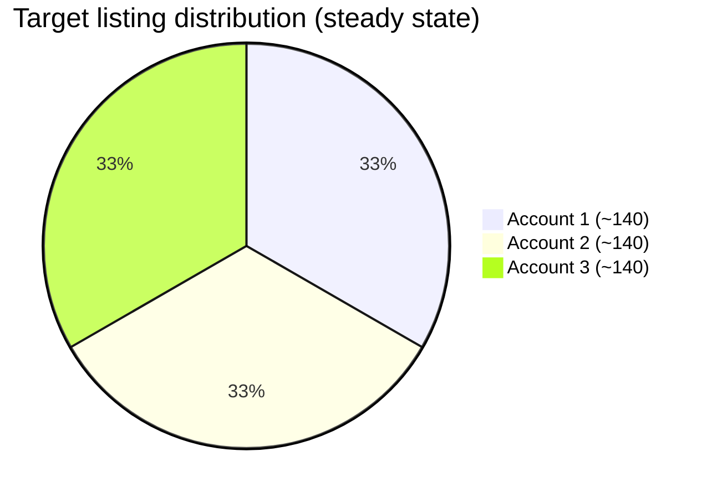
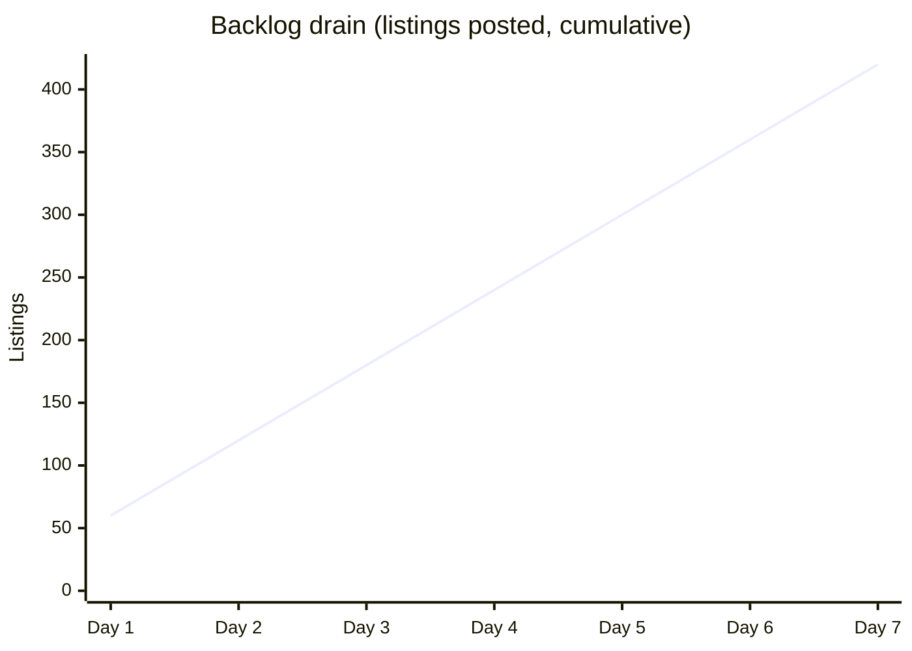
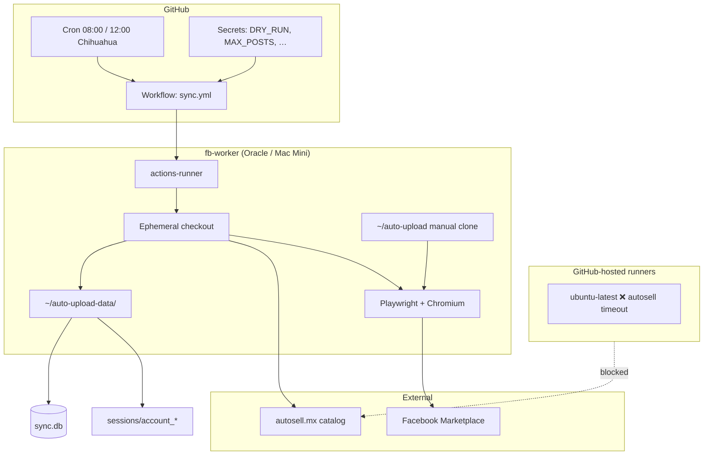
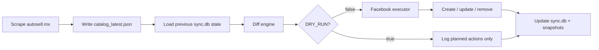
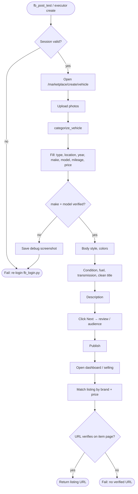
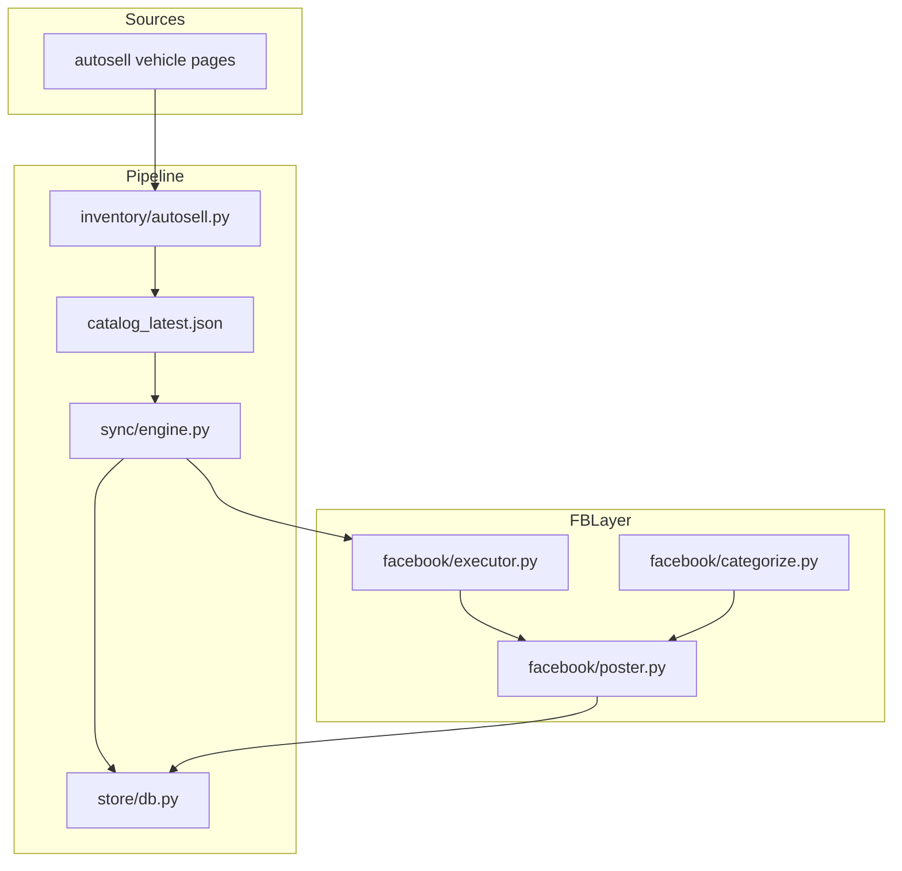
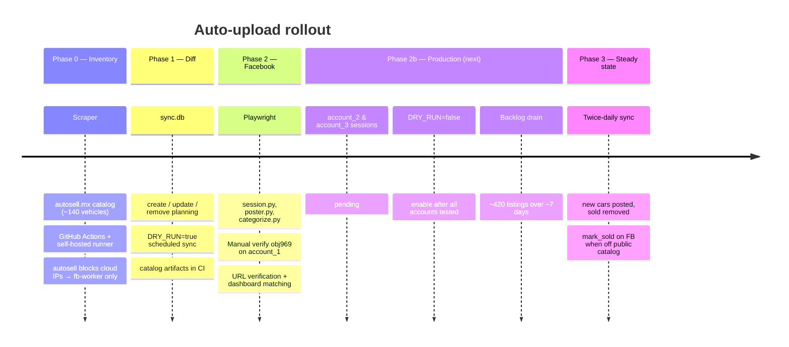
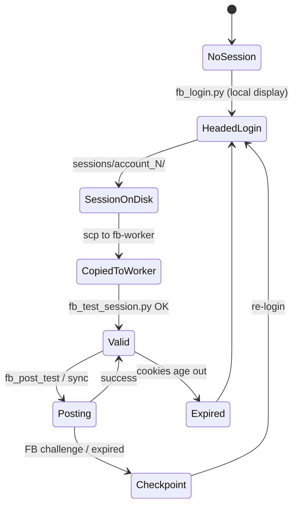
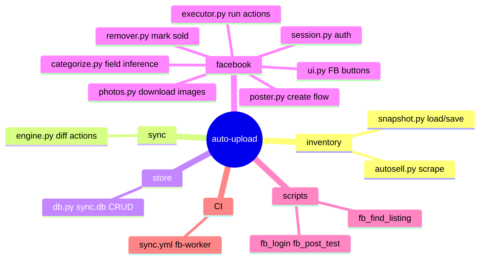

# Project guide — Auto-upload

Visual reference for architecture, flows, user stories, quality checks, and rollout statistics.

**Related:** [SETUP.md](../SETUP.md) (operational steps) · [README.md](../README.md) (quick start)

---

## Scale & statistics

| Metric | Value | Notes |
|--------|------:|-------|
| Public vehicles (autosell.mx) | **140** | From latest `catalog_latest.json` scrape |
| Facebook accounts | **3** | `account_1`, `account_2`, `account_3` in `config.yaml` |
| Target FB listings (full sync) | **~420** | 140 vehicles × 3 accounts |
| Posts per account per run | **10** | `MAX_POSTS_PER_ACCOUNT_PER_RUN` (configurable) |
| Scheduled runs per day | **2** | ~08:00 & ~12:00 America/Chihuahua |
| Max new listings per day (all accounts) | **~60** | 10 × 3 × 2 runs |
| Estimated days to initial backlog drain | **~7** | 420 ÷ 60 ≈ 7 days at full cap |
| Playwright photos per listing (default test) | **3** | `fb_post_test.py --max-photos 3` |
| CI job timeout | **120 min** | `.github/workflows/sync.yml` |
| Verified manual test vehicle | **obj969** | 2020 Audi A3, $349,000, account_1 |





*Assumes `DRY_RUN=false`, all sessions valid, cap 10/account/run, 2 runs/day, no failures.*

---

## System architecture



---

## End-to-end sync flow



---

## Facebook create listing flow (Playwright)



---

## Data flow & persistence



| Store | Key tables / files | Purpose |
|-------|---------------------|---------|
| `sync.db` | vehicles, fb_listings, sync runs | Idempotency, FB URL per account×vehicle |
| `catalog_latest.json` | 140 vehicle records | Point-in-time scrape for diff |
| `sessions/account_*` | Playwright storage state | FB auth cookies |
| `data/logs/facebook/` | PNG screenshots | Debug failed form steps |

---

## Project timeline (phases)



---

## User stories

### Dealer / operator (primary)

| ID | Story | Acceptance criteria | Status |
|----|-------|---------------------|--------|
| US-01 | As an operator, I want the public autosell catalog scraped twice daily so FB stays in sync without manual copy-paste. | Workflow green on fb-worker; ~140 vehicles in snapshot; diff logged. | Done |
| US-02 | As an operator, I want each new public vehicle posted to **3 FB accounts** in Chihuahua. | Same vehicle on account_1/2/3; location Chihuahua; photos from autosell. | In progress (1/3 accounts) |
| US-03 | As an operator, I want sold/removed autosell vehicles marked sold on FB. | `remove` action in diff; `remover.py` executes when `DRY_RUN=false`. | Implemented, not live |
| US-04 | As an operator, I want price/title changes on autosell reflected on FB. | `update` action when content hash changes. | Implemented, not live |
| US-05 | As an operator, I want failed FB runs to leave debug screenshots. | PNG under `data/logs/facebook/{autosell_id}_*.png`. | Done |
| US-06 | As an operator, I want listing URLs stored per account×vehicle. | Row in `fb_listings` with verified URL. | Done |

### Developer / maintainer

| ID | Story | Acceptance criteria | Status |
|----|-------|---------------------|--------|
| US-10 | As a developer, I want to test one vehicle without full sync. | `fb_post_test.py --autosell-id obj969` succeeds. | Done (account_1) |
| US-11 | As a developer, I want autosell fields mapped when FB requires extra dropdowns. | `categorize.py` fills body style, colors, fuel, etc. | Done |
| US-12 | As a developer, I want false-positive “posted” URLs rejected. | Verify requires brand + price/model on item page. | Done |

### End buyer (indirect)

| ID | Story | Acceptance criteria |
|----|-------|---------------------|
| US-20 | As a buyer on FB Marketplace, I want accurate year/make/model/price/km. | Listing preview matches autosell catalog fields. |
| US-21 | As a buyer, I want a link to more info on autosell.mx. | Description includes vehicle URL. |

---

## Account & session lifecycle



---

## Quality assurance

### Manual test checklist (pre-production)

| # | Test | Command / action | Pass criteria |
|---|------|------------------|---------------|
| QA-01 | Scrape | `python run_sync.py --scrape-only` | ≥130 vehicles, no timeout |
| QA-02 | Dry-run diff | `python run_sync.py --dry-run` | Actions listed; no FB browser |
| QA-03 | Session | `scripts/fb_test_session.py --account account_N` | Logged-in marketplace page |
| QA-04 | Single post | `scripts/fb_post_test.py --account account_1 --autosell-id obj969` | `Posted:` URL; dashboard shows Audi A3 |
| QA-05 | URL lookup | `scripts/fb_find_listing.py --account account_1 --autosell-id obj969` | URL contains correct brand/price on item page |
| QA-06 | Categorization | `python -c "from src.facebook.categorize import categorize_vehicle; …"` | Sensible body/color/fuel for sample vehicles |
| QA-07 | CI workflow | Manual **Run workflow** on GitHub | Green on `fb-worker`; artifact uploaded |
| QA-08 | Persistence | Re-run workflow | `sync.db` row counts grow; sessions unchanged |

### Regression scenarios (Facebook form)

| Scenario | Input | Expected FB values |
|----------|-------|-------------------|
| Sedan, Spanish marca | Audi, `A 3`, 92k km | Make Audi, Model A3, Sedan, Silver |
| SUV slug | `cx-50`, Mazda | Body style SUV |
| Pickup | Ram 1500 | Body style Truck, type Car/Truck |
| Mercedes naming | `Mercedes Benz` | Make **Mercedes-Benz** |
| KIA casing | `KIA` | Make **Kia** |

### Automated tests (current & planned)

| Area | Status | Notes |
|------|--------|-------|
| Unit: `categorize.py` | Planned | No `tests/` package yet — run inline checks |
| Unit: `parse_mxn_price`, mileage | Planned | Pure functions in `util.py` / `categorize.py` |
| Integration: scrape | Manual | Requires autosell reachability |
| E2E: FB post | Manual | `fb_post_test.py` on fb-worker only |

**Suggested local categorization smoke test:**

```bash
python -c "
from src.facebook.categorize import categorize_vehicle
from src.models import Vehicle
for vid, title, brand, slug in [
    ('obj969', 'A 3', 'Audi', 'audi-a-3-2020'),
    ('x', 'CX 50', 'Mazda', 'mazda-cx50-2024'),
    ('y', '1500', 'Ram', 'ram-1500-2025'),
]:
    v = Vehicle(vid, slug, title, brand, '2020', '\$100', '50,000 kms', '', 'http://x')
    print(vid, categorize_vehicle(v).summary())
"
```

---

## Module map



---

## Risk & decision log (summary)

| Risk | Mitigation |
|------|------------|
| autosell blocks datacenter IP | Self-hosted fb-worker only |
| FB checkpoint / session expiry | Headed re-login; Telegram alert (optional) |
| Wrong listing URL returned | Dashboard match + strict `_verify_listing_url` |
| Form UI changes | Debug PNGs; labeled button helpers in `ui.py` |
| Rate limits / spam flags | Delays between actions; 10 posts/account/run cap |

---

## Glossary

| Term | Meaning |
|------|---------|
| **fb-worker** | Self-hosted GitHub Actions runner (label) on Oracle or Mac Mini |
| **DRY_RUN** | When `true`, plan FB actions but do not execute |
| **autosell_id** | Internal id e.g. `obj969` |
| **content_hash** | Detects catalog changes for update actions |
| **Being reviewed** | FB moderation state for new listings — normal short-term |
