# Project guide — Auto-upload

Visual reference for architecture, flows, user stories, quality checks, and rollout statistics.

**Related:** [SETUP.md](../SETUP.md) (operational steps) · [README.md](../README.md) (quick start)

---

## Scale & statistics

| Metric | Value | Notes |
|--------|------:|-------|
| Public vehicles (autosell.mx) | **~134** | From latest `catalog_latest.json` scrape |
| Facebook accounts | **3** | `account_1`, `account_2`, `account_3` in `config.yaml` |
| Active sync accounts | **2** | `sync.active_accounts`: account_1, account_2 |
| Target FB listings (active accounts) | **~268** | 134 vehicles × 2 accounts |
| Target FB listings (all 3, future) | **~402** | 134 × 3 when account_3 enabled |
| Posts per account per run | **10** | `MAX_POSTS_PER_ACCOUNT_PER_RUN` (configurable) |
| Scheduled runs per day | **2** sync + **1/week** repost | ~08:00 & ~12:00 sync; Sun 09:00 repost |
| Max new listings per day (active accounts) | **~40** | 10 × 2 × 2 sync runs |
| Max reposts per week (active accounts) | **~20** | 10 × 2 accounts (configurable) |
| CI job timeout | **120 min** | `.github/workflows/sync.yml` |
| Verified manual test vehicle | **obj969** | 2020 Audi A3 on all 3 accounts |
| Live scheduled posting | **On** | `DRY_RUN=false`; account_1 + account_2 at 134/134 |

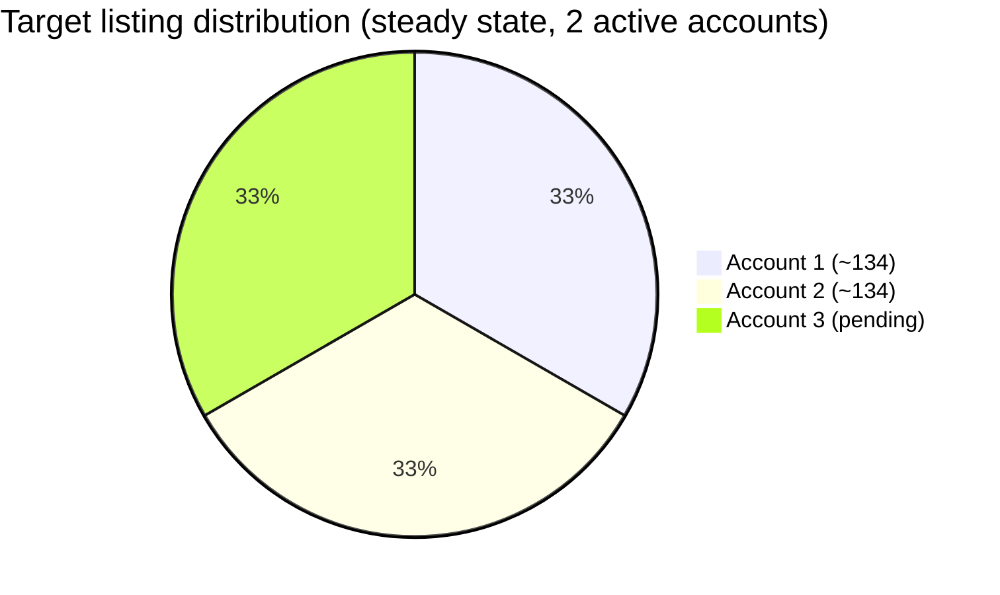
```mermaid
pie title Target listing distribution (steady state, 2 active accounts)
    "Account 1 (~134)" : 134
    "Account 2 (~134)" : 134
    "Account 3 (pending)" : 134
```

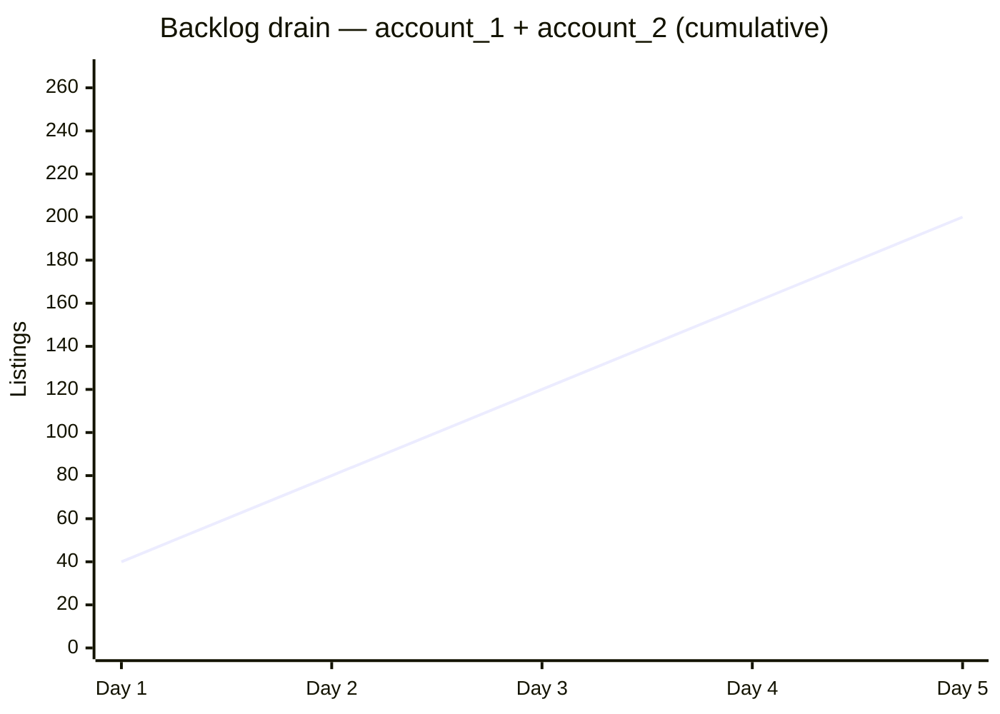
```mermaid
xychart-beta
    title "Backlog drain — account_1 + account_2 (cumulative)"
    x-axis ["Day 1", "Day 2", "Day 3", "Day 4", "Day 5"]
    y-axis "Listings" 0 --> 268
    line [40, 80, 120, 160, 200]
```

*Initial drain for account_1 + account_2 completed Jul 2026. Steady-state runs handle new catalog vehicles and price updates.*

---

## System architecture

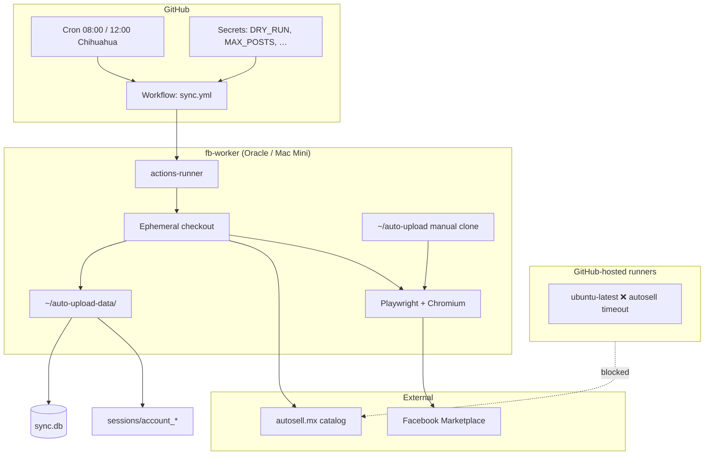
```mermaid
flowchart TB
    subgraph GitHub["GitHub"]
        CRON["Cron 08:00 / 12:00 Chihuahua"]
        WF["Workflow: sync.yml"]
        SEC["Secrets: DRY_RUN, MAX_POSTS, …"]
    end

    subgraph CloudBlocked["GitHub-hosted runners"]
        X["ubuntu-latest ❌ autosell timeout"]
    end

    subgraph FBWorker["fb-worker (Oracle / Mac Mini)"]
        RUNNER["actions-runner"]
        REPO["Ephemeral checkout"]
        PERSIST["~/auto-upload-data/"]
        CLONE["~/auto-upload manual clone"]
        PW["Playwright + Chromium"]
    end

    subgraph External["External"]
        AS["autosell.mx catalog"]
        FB["Facebook Marketplace"]
    end

    CRON --> WF
    SEC --> WF
    WF --> RUNNER
    RUNNER --> REPO
    REPO --> PERSIST
    PERSIST --> DB[(sync.db)]
    PERSIST --> SESS[sessions/account_*]
    REPO --> AS
    REPO --> PW
    PW --> FB
    CLONE --> PW
    CloudBlocked -.->|blocked| AS
```

---

## End-to-end sync flow

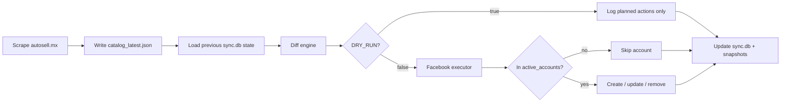
```mermaid
flowchart LR
    A[Scrape autosell.mx] --> B[Write catalog_latest.json]
    B --> C[Load previous sync.db state]
    C --> D[Diff engine]
    D --> E{DRY_RUN?}
    E -->|true| F[Log planned actions only]
    E -->|false| G[Facebook executor]
    G --> G2{In active_accounts?}
    G2 -->|no| SKIP[Skip account]
    G2 -->|yes| H[Create / update / remove]
    H --> I[Update sync.db + snapshots]
    F --> I
    SKIP --> I
```

---

## Facebook create listing flow (Playwright)

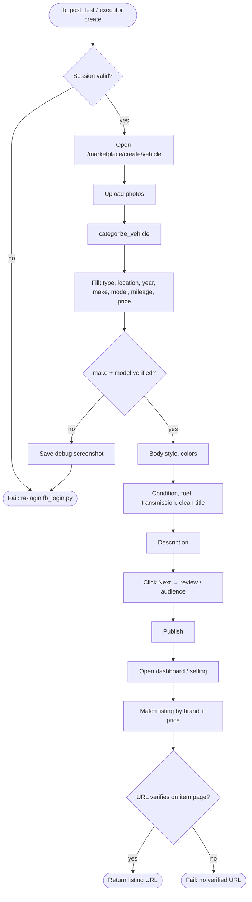
```mermaid
flowchart TD
    START([fb_post_test / executor create]) --> LOGIN{Session valid?}
    LOGIN -->|no| FAIL1([Fail: re-login fb_login.py])
    LOGIN -->|yes| OPEN[Open /marketplace/create/vehicle]
    OPEN --> PHOTOS[Upload photos]
    PHOTOS --> CAT[categorize_vehicle]
    CAT --> CORE[Fill: type, location, year, make, model, mileage, price]
    CORE --> VERIFY1{make + model verified?}
    VERIFY1 -->|no| DBG1[Save debug screenshot]
    VERIFY1 -->|yes| APPEAR[Body style, colors]
    APPEAR --> DETAIL[Condition, fuel, transmission, clean title]
    DETAIL --> DESC[Description]
    DESC --> NEXT1[Click Next → review / audience]
    NEXT1 --> PUBLISH[Publish]
    PUBLISH --> DASH[Open dashboard / selling]
    DASH --> MATCH[Match listing by brand + price]
    MATCH --> VERIFY2{URL verifies on item page?}
    VERIFY2 -->|yes| OK([Return listing URL])
    VERIFY2 -->|no| FAIL2([Fail: no verified URL])
    DBG1 --> FAIL1
```

---

## Data flow & persistence

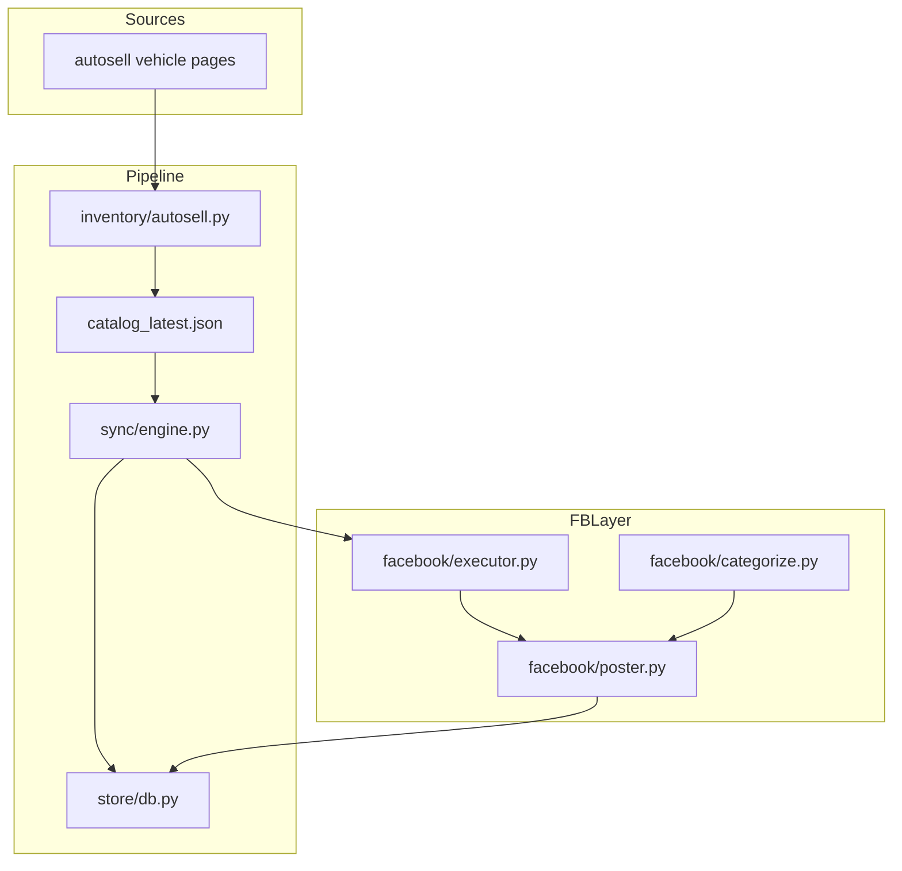
```mermaid
flowchart TB
    subgraph Sources
        AS_V[autosell vehicle pages]
    end

    subgraph Pipeline
        SCRAPER[inventory/autosell.py]
        SNAP[catalog_latest.json]
        ENGINE[sync/engine.py]
        STORE[store/db.py]
    end

    subgraph FBLayer
        EXEC[facebook/executor.py]
        POST[facebook/poster.py]
        CAT[facebook/categorize.py]
    end

    AS_V --> SCRAPER --> SNAP --> ENGINE
    ENGINE --> STORE
    ENGINE --> EXEC
    EXEC --> POST
    CAT --> POST
    POST --> STORE
```

| Store | Key tables / files | Purpose |
|-------|---------------------|---------|
| `sync.db` | vehicles, fb_listings, sync runs | Idempotency, FB URL per account×vehicle |
| `catalog_latest.json` | ~134 vehicle records | Point-in-time scrape for diff |
| `sessions/account_*` | Playwright storage state | FB auth cookies |
| `data/logs/facebook/` | PNG screenshots | Debug failed form steps |

---

## Project timeline (phases)

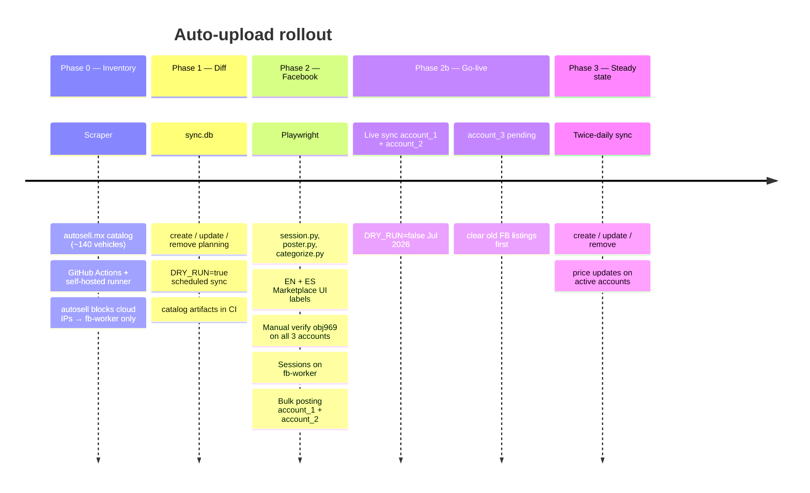
```mermaid
timeline
    title Auto-upload rollout
    section Phase 0 — Inventory
        Scraper : autosell.mx catalog (~140 vehicles)
        : GitHub Actions + self-hosted runner
        : autosell blocks cloud IPs → fb-worker only
    section Phase 1 — Diff
        sync.db : create / update / remove planning
        : DRY_RUN=true scheduled sync
        : catalog artifacts in CI
    section Phase 2 — Facebook
        Playwright : session.py, poster.py, categorize.py
        : EN + ES Marketplace UI labels
        : Manual verify obj969 on all 3 accounts
        : Sessions on fb-worker
        : Bulk posting account_1 + account_2
    section Phase 2b — Go-live
        Live sync account_1 + account_2 : DRY_RUN=false Jul 2026
        account_3 pending : clear old FB listings first
    section Phase 3 — Steady state
        Twice-daily sync : create / update / remove
        : price updates on active accounts
```

---

## How sync decides stay / go / add / update

Each run compares **autosell.mx** (scrape) to **`fb_listings` in `sync.db`** (what the app already posted), **per account**.

| Situation | Action |
|-----------|--------|
| On website, not in DB for that account | **create** (capped per run) |
| On website and in DB, same `content_hash` | **stay** (no action) |
| On website and in DB, hash changed | **update** |
| In DB as live, gone from public catalog | **remove** (`mark_sold` by default) |

**Important limits:**

- The app does **not** inventory Facebook’s “Your listings.” Manual or pre-app listings are invisible to the planner.
- Leaving old manual listings while the app posts the same cars causes **duplicates** (and FB may suppress similar posts).
- **`update` today** only edits **price** and **description** on the existing listing (not full re-post of photos/make/model). Price changes are fully supported once live.
- With **`DRY_RUN=true`**, actions are planned and logged only.
- Only accounts in **`sync.active_accounts`** (or `--accounts` / `SYNC_ACCOUNTS`) are processed. account_3 is configured but excluded until go-live there.

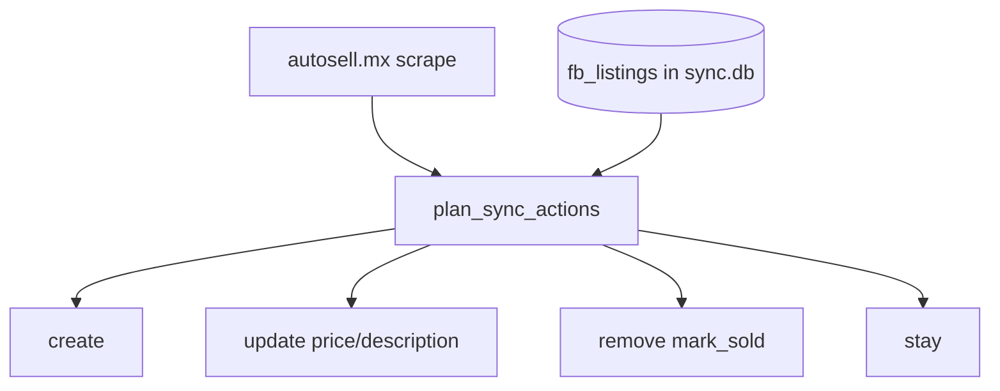
```mermaid
flowchart TD
    AS[autosell.mx scrape] --> PLAN[plan_sync_actions]
    DB[(fb_listings in sync.db)] --> PLAN
    PLAN --> C[create]
    PLAN --> U[update price/description]
    PLAN --> R[remove mark_sold]
    PLAN --> S[stay]
```

---

## Go-live checklist

### account_1 + account_2 (live)

1. [x] Sessions for `account_1`, `account_2`, `account_3` on fb-worker (`fb_test_session.py` → Logged in: True).
2. [x] Manual `fb_post_test.py` succeeds on each account (Spanish UI labels supported).
3. [x] Bulk sync verified — 134/134 catalog vehicles live on account_1 and account_2.
4. [x] GitHub secret `DRY_RUN=false`.
5. [x] `config.yaml` → `sync.active_accounts: [account_1, account_2]`.

### account_3 (pending)

1. [ ] account_3 operator: **mark sold or delete** active listings on Facebook.
2. [ ] Add `account_3` to `sync.active_accounts` in `config.yaml` and push.
3. [ ] Optional: one manual run `python run_sync.py --accounts account_3` on fb-worker.
4. [ ] Monitor first scheduled run for account_3 (cap 10 posts/run).

---

## Planned / to be implemented

| Item | Priority | Notes |
|------|----------|-------|
| Enable **account_3** in scheduled sync | High | After operator clears old FB listings; add to `active_accounts` |
| **Repost with holds** | Done | `run_repost.py`, `fb_repost_hold.py`, `repost_holds` table |
| Scheduled weekly repost job | Done | `.github/workflows/repost.yml` — Sun 09:00 Chihuahua |
| Richer **update** (photos, title, mileage) | Medium | Today: price + description only |
| Inventory FB dashboard (discover untracked listings) | Low | Avoids manual wipe; complex / fragile |
| One-off `fb_clear_listings.py` (mark sold) | Low | Only if inventory is huge; prefer manual |
| Unit tests for `categorize.py` / price parse | Medium | No `tests/` package yet |
| Faster post-publish URL capture | Medium | Occasional verify false-negative (obj329); listing may already be live |
| Exterior color reliability on all locales | Done | Plateado alias; occasional retry pass |
| Photo limit enforcement | Done | `FB_MAX_PHOTOS = 20`; >20 blocked Next |
| Ubicación / Precio field handling (es-MX) | Done | Keyboard fill strategies for Precio |
| Powersport field set (Todoterreno) | Done | Can-Am → Todoterreno + free-text Marca |
| Shelby / exotic makes | Done | Shelby → Ford in Marca; model `Shelby Cobra` |
| Live sync account_1 + account_2 | Done | Jul 2026; `DRY_RUN=false` |
| Account scoping (`active_accounts`) | Done | config.yaml + `--accounts` + `SYNC_ACCOUNTS` |

---

## User stories

### Dealer / operator (primary)

| ID | Story | Acceptance criteria | Status |
|----|-------|---------------------|--------|
| US-01 | As an operator, I want the public autosell catalog scraped twice daily so FB stays in sync without manual copy-paste. | Workflow green on fb-worker; ~140 vehicles in snapshot; diff logged. | Done |
| US-02 | As an operator, I want each new public vehicle posted to **active FB accounts** in Chihuahua. | Same vehicle on account_1/2; location Chihuahua; photos from autosell. | **Live** on account_1 + account_2; account_3 pending |
| US-03 | As an operator, I want sold/removed autosell vehicles marked sold on FB. | `remove` action in diff; `remover.py` executes when `DRY_RUN=false`. | **Live** on active accounts |
| US-04 | As an operator, I want **price** changes on autosell reflected on all FB accounts. | `update` when `content_hash` changes; price field + description. | **Live** on active accounts |
| US-05 | As an operator, I want failed FB runs to leave debug screenshots. | PNG under `data/logs/facebook/{autosell_id}_*.png`. | Done |
| US-06 | As an operator, I want listing URLs stored per account×vehicle. | Row in `fb_listings` with verified URL. | Done |
| US-07 | As an operator, I want to avoid duplicate listings when enabling the app. | Clear old FB inventory before adding account to `active_accounts`. | Done for acct 1+2; pending acct 3 |

### Developer / maintainer

| ID | Story | Acceptance criteria | Status |
|----|-------|---------------------|--------|
| US-10 | As a developer, I want to test one vehicle without full sync. | `fb_post_test.py --autosell-id obj969` succeeds. | Done (all 3 accounts) |
| US-11 | As a developer, I want EN and ES Marketplace UIs supported. | Labels like Marca, Carrocería, Estado del vehículo. | Done |
| US-13 | As a developer, I want Can-Am / UTV posted under Todoterreno. | Vehicle type Todoterreno; Marca free-text (any brand). | Done |
| US-12 | As a developer, I want false-positive “posted” URLs rejected. | Verify requires brand + price/model on item page. | Done |

### End buyer (indirect)

| ID | Story | Acceptance criteria |
|----|-------|---------------------|
| US-20 | As a buyer on FB Marketplace, I want accurate year/make/model/price/km. | Listing preview matches autosell catalog fields. |
| US-21 | As a buyer, I want a link to more info on autosell.mx. | Description includes vehicle URL. |

---

## Account & session lifecycle

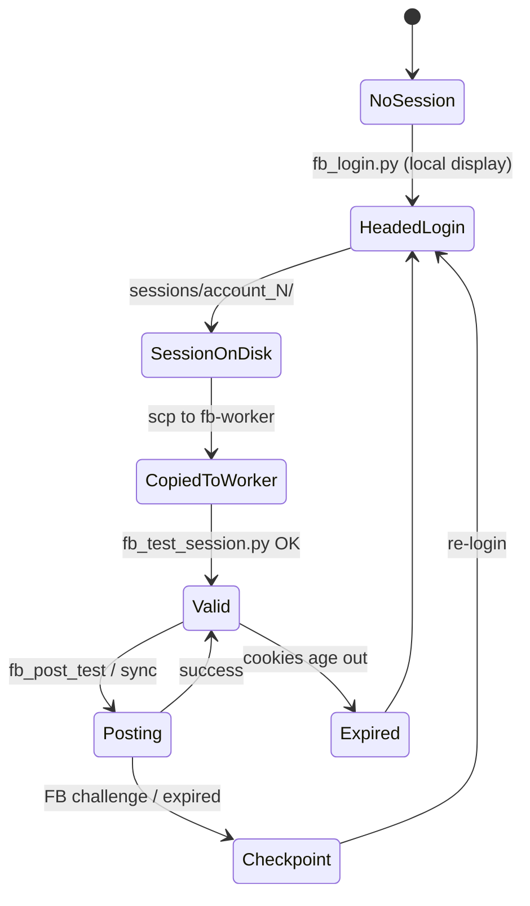
```mermaid
stateDiagram-v2
    [*] --> NoSession
    NoSession --> HeadedLogin: fb_login.py (local display)
    HeadedLogin --> SessionOnDisk: sessions/account_N/
    SessionOnDisk --> CopiedToWorker: scp to fb-worker
    CopiedToWorker --> Valid: fb_test_session.py OK
    Valid --> Posting: fb_post_test / sync
    Posting --> Valid: success
    Posting --> Checkpoint: FB challenge / expired
    Checkpoint --> HeadedLogin: re-login
    Valid --> Expired: cookies age out
    Expired --> HeadedLogin
```

---

## Quality assurance

### Manual test checklist (pre-production)

| # | Test | Command / action | Pass criteria |
|---|------|------------------|---------------|
| QA-01 | Scrape | `python run_sync.py --scrape-only` | ≥130 vehicles, no timeout |
| QA-02 | Dry-run diff | `python run_sync.py --dry-run` | Actions listed; no FB browser |
| QA-03 | Session | `scripts/fb_test_session.py --account account_N` | Logged-in marketplace page |
| QA-04 | Single post (each account) | `scripts/fb_post_test.py --account account_N --autosell-id obj969` | `Posted:` URL; dashboard shows Audi A3 |
| QA-04b | SUV + Powersport (es-MX) | `obj1126` (Traverse, `--max-photos 20`), `obj1125` (Maverick) | Auto/camioneta vs Todoterreno; ≤20 photos |
| QA-05 | URL lookup | `scripts/fb_find_listing.py --account account_N --autosell-id obj969` | URL contains correct brand/price on item page |
| QA-06 | Categorization | `python -c "from src.facebook.categorize import categorize_vehicle; …"` | Sensible body/color/fuel for sample vehicles |
| QA-07 | CI workflow | Manual **Run workflow** on GitHub | Green on `fb-worker`; artifact uploaded |
| QA-08 | Persistence | Re-run workflow | `sync.db` row counts grow; sessions unchanged |
| QA-09 | Mini live | Cap 1–2, `DRY_RUN=false`, one run | Passed Jul 2026 before full drain |
| QA-10 | Full live (2 accounts) | Scheduled sync, 134/134 each | Passed Jul 2026 |

### Regression scenarios (Facebook form)

| Scenario | Input | Expected FB values |
|----------|-------|-------------------|
| Spanish UI (es-MX) | Audi, `A 3` | Marca Audi, Modelo A3, Carrocería Sedán |
| English UI | Audi, `A 3` | Make Audi, Model A3, Body style Sedan |
| Can-Am / UTV (es-MX) | Maverick XRC (`obj1125`) | Tipo **Todoterreno**, Marca free-text **Can-Am** |
| Polaris RZR / RAZR | RZR … | Tipo **Todoterreno**, Marca free-text **Polaris** |
| SUV + many photos | Traverse LT (`obj1126`) | Auto/camioneta, **≤20 photos** (21 keeps Siguiente disabled) |
| SUV slug | `cx-50`, Mazda | Body style SUV |
| Pickup | Ram 1500 | Body style Truck / Camioneta |
| Mercedes naming | `Mercedes Benz` | Make **Mercedes-Benz** |
| KIA casing | `KIA` | Make **Kia** |
| Shelby Cobra | `Shelby`, `Cobra` | Marca **Ford**, Modelo **Shelby Cobra** |

### Automated tests (current & planned)

| Area | Status | Notes |
|------|--------|-------|
| Unit: `categorize.py` | Planned | No `tests/` package yet |
| Unit: `parse_mxn_price`, mileage | Planned | Pure functions |
| Integration: scrape | Manual | Requires autosell reachability |
| E2E: FB post | Manual | `fb_post_test.py` local or on fb-worker |
| Mini live sync | Done | Jul 2026 |
| Full live sync (2 accounts) | Done | account_1 + account_2 at 134/134 |

**Suggested local categorization smoke test:**

```bash
python -c "
from src.facebook.categorize import categorize_vehicle
from src.models import Vehicle
for vid, title, brand, slug in [
    ('obj969', 'A 3', 'Audi', 'audi-a-3-2020'),
    ('x', 'CX 50', 'Mazda', 'mazda-cx50-2024'),
    ('y', '1500', 'Ram', 'ram-1500-2025'),
]:
    v = Vehicle(vid, slug, title, brand, '2020', '\$100', '50,000 kms', '', 'http://x')
    print(vid, categorize_vehicle(v).summary())
"
```

---

## Configuration (account scoping)

```yaml
# config.yaml
sync:
  active_accounts:
    - account_1
    - account_2
    # account_3: add after old FB listings cleared
```

Priority for which accounts run:

1. CLI `--accounts account_1 account_2`
2. Env `SYNC_ACCOUNTS=account_1,account_2`
3. `config.yaml` → `sync.active_accounts`
4. All accounts in `config.yaml` (fallback)

---

## Module map

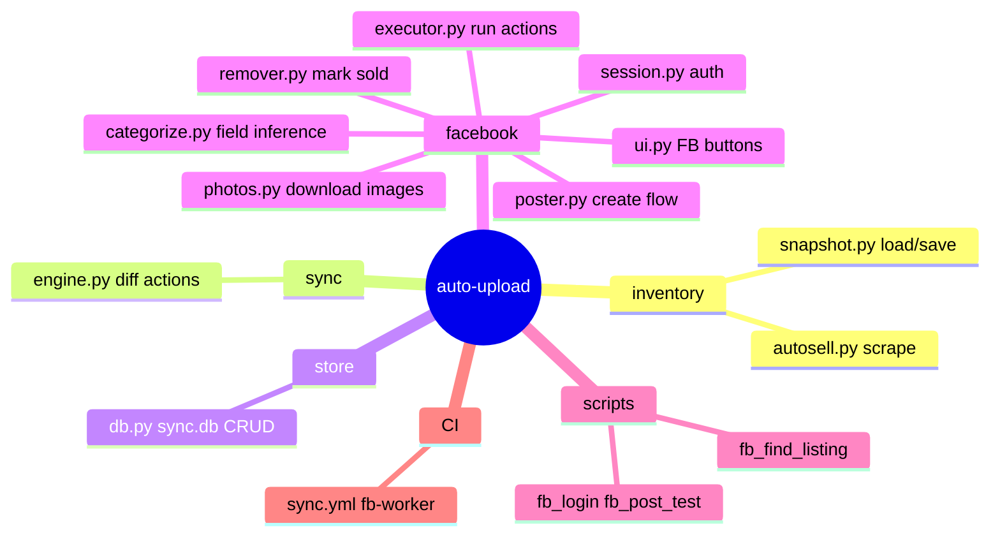
```mermaid
mindmap
  root((auto-upload))
    inventory
      autosell.py scrape
      snapshot.py load/save
    sync
      engine.py diff actions
    store
      db.py sync.db CRUD
    facebook
      session.py auth
      poster.py create flow
      categorize.py field inference
      executor.py run actions
      photos.py download images
      remover.py mark sold
      ui.py FB buttons
    scripts
      fb_login fb_post_test
      fb_find_listing
    CI
      sync.yml fb-worker
```

---

## Risk & decision log (summary)

| Risk | Mitigation |
|------|------------|
| autosell blocks datacenter IP | Self-hosted fb-worker only |
| FB checkpoint / session expiry | Headed re-login; Telegram alert (optional) |
| Wrong listing URL returned | Dashboard match + strict `_verify_listing_url` |
| Form UI changes | Debug PNGs; labeled button helpers in `ui.py` |
| Rate limits / spam flags | Delays between actions; 10 posts/account/run cap |
| Duplicate listings at go-live | Clear old FB inventory before adding account to `active_accounts` |
| account_3 not in sync | Intentional until operator clears old listings |
| Mass-delete on Facebook | Not reliable via API; mark sold / delete manually |

---

## Glossary

| Term | Meaning |
|------|---------|
| **fb-worker** | Self-hosted GitHub Actions runner (label) on Oracle or Mac Mini |
| **DRY_RUN** | When `true`, plan FB actions but do not execute. Currently `false` in production. |
| **active_accounts** | Subset of `config.yaml` accounts included in scheduled sync |
| **autosell_id** | Internal id e.g. `obj969` |
| **content_hash** | Detects catalog changes (price, photos, title, …) for update actions |
| **Being reviewed** / **Se está revisando** | FB moderation for new listings — normal short-term |
| **Lean session** | Session copy without browser Cache/GPUCache (few MB vs 100MB+) |

---

## Phase 2 Architecture & Integrations

Scaffolded modules under `src/` for lead-to-quote-to-message automation. They do **not** replace the existing Facebook Marketplace sync pipeline (`run_sync.py` → inventory → sync engine → `src/facebook/`).

### Module roles

| Module | Path | Responsibility |
|--------|------|----------------|
| **quote_engine** | `src/quote_engine/` | Local French Amortization calculator. Pure Python, no network I/O. All payment schedules and quote figures are computed in-process (milliseconds) **before** any CRM or messaging payload is built. |
| **odoo_sync** | `src/odoo_sync/` | Odoo CRM XML-RPC client. Creates/updates leads and opportunities; inventory upsert (`product.template`); chatter quotes. Credentials from `.env` only. |
| **whatsapp_worker** | `src/whatsapp_worker/` | Thin API wrapper for open-wa / Evolution API. Outbound dispatch of approved quotes and follow-ups. Separate config and process boundary from Playwright. |
| **voice_gateway** | `src/voice_gateway/` | FastAPI app entry: `POST /webhook/voice-lead` and Meta routes (`/webhook/facebook`). Invokes `AutosellPipeline` / `MetaWebhookGateway`. |
| **meta_gateway** | `src/meta_gateway/` | Official Facebook Page Messenger webhook: verify token, parse events, quote via `quote_engine`, upsert Odoo lead + chatter, reply via Graph API `/me/messages`. |
| **pipeline** | `src/pipeline.py` | Orchestrates trade-in → Scotiabank quote → Odoo → WhatsApp for Voice / Web leads. |

### Incoming lead flow (Web / Voice AI / Messenger → Odoo → channel)

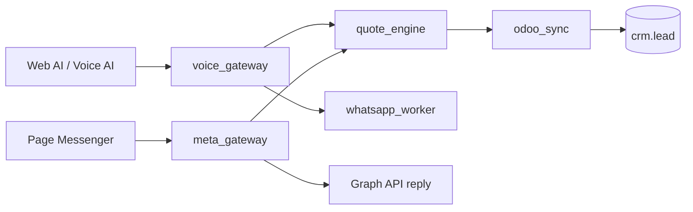
```mermaid
flowchart LR
    WEB[Web AI / Voice AI]
    MSG[Page Messenger]
    VG[voice_gateway]
    MG[meta_gateway]
    QE[quote_engine]
    ODOO[odoo_sync]
    LEAD[(crm.lead)]
    WA[whatsapp_worker]
    GRAPH[Graph API reply]

    WEB --> VG
    VG --> QE
    MSG --> MG
    MG --> QE
    QE --> ODOO
    ODOO --> LEAD
    VG --> WA
    MG --> GRAPH
```

1. **Capture** — Voice AI hits `POST /webhook/voice-lead`; Messenger hits `POST /webhook/facebook` (after `GET` verify with `FB_VERIFY_TOKEN`).
2. **Quote** — `quote_engine` runs French Amortization locally (Scotiabank profile when configured). No external calc service.
3. **Persist** — `odoo_sync` upserts `crm.lead` and posts quote text to chatter.
4. **Dispatch** — Voice/Web path may use `whatsapp_worker`; Messenger path replies via Graph API (`FB_PAGE_ACCESS_TOKEN`).

Facebook Marketplace sync remains independent: catalog scrape → Odoo inventory sync → `sync.db` diff → Playwright on `sessions/account_*`.

### Isolation rules (scraping vs messaging)

| Rule | Scraping workers (`src/facebook/`, inventory) | Messaging / webhooks (`whatsapp_worker`, `meta_gateway`) |
|------|-----------------------------------------------|----------------------------------------------------------|
| Browser / session root | Playwright profiles in `sessions/account_*` only | No access to `sessions/`; API tokens via `.env` |
| Runtime | CI / fb-worker / headed `scripts/` — not inside LLM chat | Separate FastAPI / job; not mixed with FB browser launch |
| Secrets | FB session cookies on disk; never commit | WhatsApp / Meta Page tokens in `.env` only (`FB_*`, `WHATSAPP_*`) |
| Shared state | `sync.db`, catalog snapshots | Odoo lead IDs — not FB listing rows |
| Cross-talk | Must not import WhatsApp / Meta Graph mid-scrape | Must not open Chromium with Marketplace session dirs |

**Hard boundaries:** never reuse a Marketplace Playwright context for WhatsApp or Messenger automation; never run live browser scripts from the IDE chat window; never hardcode CRM or messaging credentials.
