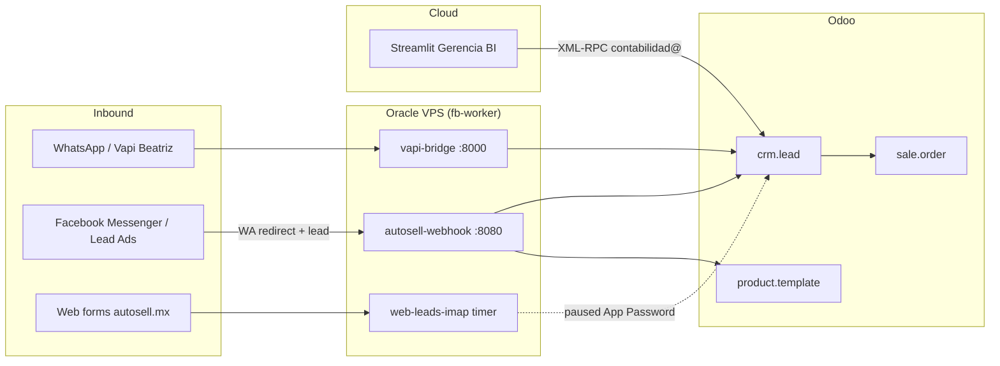

# Autosell Ecosystem - Technical & Operational Documentation

**Related:** [PROJECT_GUIDE.md](PROJECT_GUIDE.md) (FB Marketplace sync) · [SETUP.md](../SETUP.md) · [STATUS.md](../STATUS.md) · [README.md](../README.md)

Last updated: **2026-09-29**

---

## 1. Core Architecture



| Role | Who / What |
|------|------------|
| **Inbound AI Bot** | WhatsApp (Vapi Beatriz) → Oracle webhook / vapi-bridge → Odoo CRM |
| **Appointment Setter** | **Marco** (`res.users` setter; virtual AI / setter ownership on web & WA leads) |
| **Branch Closers (RR)** | See below — round-robin after setter qualifies / books |
| **Gerencia BI** | Streamlit Cloud [gerencia-comercial-autosell.streamlit.app](https://gerencia-comercial-autosell.streamlit.app) |

### Branch closers (round robin)

| Branch | Closers (WhatsApp RR / `REPS_*`) |
|--------|----------------------------------|
| **Periférico** | Ivan, Alfonso, Veronica, **Karen Quiñonez** (`+526142861334`, `res.users` 21) |
| **San Felipe** | Francisco, Aaron, Charly, Loreto |

**Removed (archived in Odoo, out of RR):** Irving / Iriving Robles Padilla (`res.users` 14), Gonzalo Bernal “Chalo” (`res.users` 13).

Mapping source of truth: `data/odoo_mapping.json` (from `scripts/setup_odoo_structure.py`). Env rosters: `REPS_PERIFERICO` / `REPS_SAN_FELIPE`.

### Runtime topology

| Surface | Host | Notes |
|---------|------|-------|
| Meta + WA webhooks | Oracle `autosell-webhook` | FastAPI `src/voice_gateway/webhook.py` |
| Vapi tool bridge | Oracle `vapi-bridge` | Inventory / financing / appointments |
| FB Marketplace scrape/post | Oracle / CI `fb-worker` | `run_sync.py` — isolated Playwright sessions |
| Odoo SaaS | `autosellmx.odoo.com` | XML-RPC as **`contabilidad@autosell.mx`** |
| Catalog scrape + FB sync | `sync.yml` on fb-worker | **Every 3h** UTC (+ 14:00 for inventory window) |
| Catalog → Odoo inventory | same workflow, gated step | **2×/day only** 08:00 & 18:00 Chihuahua; **diff-only** writes |
| Gerencia dashboard | Streamlit Community Cloud / local `:8501` | Active production leads only |

Inventory sync (`scripts/sync_odoo_inventory.py`) bulk-loads Odoo SKUs, compares name/price in memory, and **skips unchanged** products so no-op runs finish in ~1s.

---

## 2. Odoo Module Standard Operating Procedures

### CRM (`crm.lead`)

Receives automated leads from:

- WhatsApp (Evolution / Vapi Beatriz)
- Facebook Messenger + Lead Ads (Graph webhook → Odoo + WA redirect)
- Web forms (IMAP path when App Password is available)

**Attribution** (`utm.medium` / `utm.source`) is always written on create/update — see §3.

**Ownership:** Setter (Marco) owns inbound web/WA qualification; closers get RR notify + appointment assignment (`src/odoo_sync/appointment_sync.py`).

**Tag:** `MG Quote Lead` marks Beatriz / quote-pipeline opportunities (production — do **not** mass-delete via `--purge-mg-quote-leads` unless intentional).

**Test data:** permanently unlink smoke leads (not archive-only):

```bash
PYTHONPATH=. python scripts/cleanup_odoo_test_data.py --dry-run --hard-delete --skip-sales
PYTHONPATH=. python scripts/cleanup_odoo_test_data.py --hard-delete --skip-sales
# Patterns: Prueba, ATTR TEST, Llamada Paulina, Marco Test, RR Fresh Test, …
```

### Inventory (`stock.warehouse` / `product.template`)

Live website catalog (`data/catalog_latest.json` / autosell.mx) is the **source of truth** for what is saleable.

| Rule | Meaning |
|------|---------|
| **Consignment (`*` in title)** | Customer vehicle hosted for sale → tag **Consignación**, category `VEHICULO CONSIGNACION` |
| **Agency lot (no asterisk)** | Own inventory → tag **Lote / Propio**, category `vehiculos` |
| **Branch markers** | Trailing `*` / `-` → warehouse **Periférico**; `+` → **San Felipe** |
| **Missing from web** | Archive (`active=False`, status sold) — unit left the published catalog |

Warehouses in Odoo: `Periferico` (code Peri), `San Felipe` (code Sanf).

**Dashboard operations (Inventory app):** Recibidos · Traslados Internos · Órdenes de entrega.

```bash
PYTHONPATH=. python scripts/sync_odoo_inventory.py --from-snapshot data/catalog_latest.json
PYTHONPATH=. python scripts/sync_and_clean_inventory.py --from-snapshot data/catalog_latest.json
```

### Purchases / Sales / Finance

- **`purchase.order`** — acquisitions & reconditioning (not AI-driven).
- **`sale.order`** — formal quotes / sales; test $0 drafts cleaned via `cleanup_odoo_test_data.py`.
- **Quotes** — French amortization in `src/quote_engine/` (CrediAuto year caps); compute locally before any channel reply.

---

## 3. Traffic Routing & Lead Attribution

| Channel | `medium` | `source` | Behavior |
|---------|----------|----------|----------|
| **WhatsApp Direct** | WhatsApp | WA Directo | Evolution / Beatriz → CRM |
| **Facebook Messenger** | Facebook | FB Messenger | Autoreply → WA + CRM lead |
| **Facebook Lead Ads** | Facebook Ads | FB Lead Form | Register lead + WA redirect template |
| **Web Forms** | Website | Formulario Web | IMAP / webhook ingest |
| Voice / Phone | Phone | Inbound Call | Vapi voice path |

### WhatsApp AI turn rules (`src/lead_routing.py` + `src/whatsapp_worker/inbound.py`)

| Turn | Behavior |
|------|----------|
| **First message** (no prior session / `NEW_LEAD`) | Welcome menu once; parse vehicle (e.g. Corolla → `Toyota Corolla`); create CRM `MG Quote Lead` |
| **Follow-up** (session `AI_ACTIVE`, or menu-like text if session missed) | **No** re-greeting. Route to price/stock, financing, requisitos, or cita |
| **Precio / disponibilidad / ¿cuánto cuesta?** | Live Odoo inventory (≤3 units): model, `$… MXN`, lot (`*` Periférico / `+` San Felipe) |
| **Cita / prueba de manejo** | `HANDOFF_TO_HUMAN` + rep RR notify |

Env: `AI_MG_QUOTE_LEADS=true` (default). Optional `VAPI_WA_TEXT_FIRST=true` sends turns to Beatriz Chat first; local scripts remain the fallback.

**Facebook → WhatsApp redirect:**

> ¡Hola [Nombre]! … WhatsApp oficial: https://wa.me/526142274381

Implementation: `src/meta_gateway/messenger_autoreply.py`, map in `OdooCRMClient.LEAD_ATTRIBUTION`.

```bash
./scripts/deploy_oracle_webhook.sh
```

---

## 4. Gerencia Comercial Dashboard (Streamlit)

| Tab | Content |
|-----|---------|
| 1 · Dashboard Gerencia | KPIs, Plotly funnel by `crm.stage`, efectividad por vendedor/sucursal |
| 2 · Control Diario | Filterable prospect table (active only) + CSV |
| 3 · Financiamientos & Perdidos | Credit-stage leads, `lost_reason_id` pie, recent `sale.order` |
| 4 · Junta Semanal | Compromisos → PDF/Excel + `data/junta_semanal.json` |

**Query rules** (`dashboard/odoo_data.py`):

- Default domain: `active = True` + date window.
- Excludes test-name markers (`Prueba`, `ATTR TEST`, `Llamada Paulina`, …).

**Credentials:** `st.secrets` or `.env` — `ODOO_URL`, `ODOO_DB`, `ODOO_USERNAME=contabilidad@autosell.mx`, `ODOO_API_KEY`. Template: `.streamlit/secrets.toml.example` (never commit real keys). Dark theme: `.streamlit/config.toml`.

```bash
PYTHONPATH=. streamlit run dashboard/app.py --server.port 8501
```

---

## 5. Paused & Pending Integrations

| Item | Status | Blocker |
|------|--------|---------|
| **IMAP Web Lead Ingestion** (`marketing@autosell.mx`) | Code + timer live; soft-fail on auth | Gmail **App Password** (2FA) |
| **Neubox DNS / CNAME** (`vapi.autosell.mx`) | Deferred | Panel access; traffic on Oracle + Cloudflare tunnels |
| **Native Odoo WhatsApp** | Paused | Meta Manager + `ODOO_WA_ACCOUNT_*` |

---

## 6. Operational Cheatsheet

| Task | Command |
|------|---------|
| Structure / closers mapping | `python scripts/setup_odoo_structure.py` |
| Hard-purge test CRM leads | `python scripts/cleanup_odoo_test_data.py --hard-delete --skip-sales` |
| Diff-only inventory sync | `python scripts/sync_odoo_inventory.py --from-snapshot data/catalog_latest.json` |
| FB Marketplace sync | `python run_sync.py` (operator / CI on fb-worker) |
| Deploy WA/Meta webhook | `./scripts/deploy_oracle_webhook.sh` |
| IMAP health (after App Password) | `./scripts/deploy_oracle_webhook.sh --imap-check` |
| Local Gerencia BI | `PYTHONPATH=. streamlit run dashboard/app.py` |

Secrets: `.env` / Streamlit Cloud Secrets only (`ODOO_*`, `FB_*`, `WEB_LEADS_IMAP_*`). Never commit session cookies or API keys.
