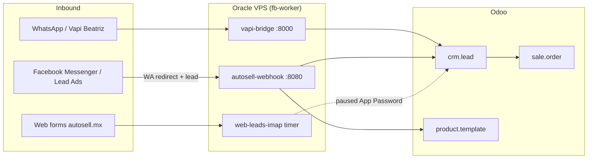

# Autosell Ecosystem - Technical & Operational Documentation

**Related:** [PROJECT_GUIDE.md](PROJECT_GUIDE.md) (FB Marketplace sync) · [SETUP.md](../SETUP.md) · [STATUS.md](../STATUS.md)

---

## 1. Core Architecture



| Role | Who / What |
|------|------------|
| **Inbound AI Bot** | WhatsApp (Vapi Beatriz) → Oracle webhook / vapi-bridge → Odoo CRM |
| **Appointment Setter** | **Marco** (`res.users` setter; virtual AI / setter ownership on web & WA leads) |
| **Branch Closers (RR)** | See below — round-robin after setter qualifies / books |

### Branch closers (round robin)

| Branch | Closers |
|--------|---------|
| **Periférico** | Ivan, Alfonso, Veronica |
| **San Felipe** | Francisco, Aaron, Charly, Loreto |

Mapping source of truth: `data/odoo_mapping.json` (from `scripts/setup_odoo_structure.py`). Env rosters: `REPS_PERIFERICO` / `REPS_SAN_FELIPE`.

### Runtime topology

| Surface | Host | Notes |
|---------|------|-------|
| Meta + WA webhooks | Oracle `autosell-webhook` | FastAPI `src/voice_gateway/webhook.py` |
| Vapi tool bridge | Oracle `vapi-bridge` | Inventory / financing / appointments |
| FB Marketplace scrape/post | Oracle / CI `fb-worker` | `run_sync.py` — isolated Playwright sessions |
| Odoo SaaS | `autosellmx.odoo.com` | XML-RPC via `src/odoo_sync/` |
| Catalog → Odoo inventory | `sync.yml` on fb-worker | **2×/day** 08:00 & 18:00 Chihuahua (`0 14` / `0 0` UTC); diff-only writes |

Inventory sync (`scripts/sync_odoo_inventory.py`) bulk-loads Odoo SKUs, compares name/price in memory, and **skips unchanged** products so no-op runs finish in seconds.

---

## 2. Odoo Module Standard Operating Procedures

### CRM (`crm.lead`)

Receives automated leads from:

- WhatsApp (Evolution / Vapi Beatriz)
- Facebook Messenger + Lead Ads (Graph webhook → Odoo + WA redirect)
- Web forms (IMAP path when App Password is available)

**Attribution** (`utm.medium` / `utm.source`) is always written on create/update — see §3.

**Ownership:** Setter (Marco) owns inbound web/WA qualification; closers get RR notify + appointment assignment (`src/odoo_sync/appointment_sync.py`).

**Tag:** `MG Quote Lead` marks Beatriz / quote-pipeline opportunities (production — do not mass-delete).

Cleanup of **test** CRM + draft SOs:

```bash
PYTHONPATH=. python scripts/cleanup_odoo_test_data.py --dry-run
PYTHONPATH=. python scripts/cleanup_odoo_test_data.py
# Destructive (all MG Quote Lead): add --purge-mg-quote-leads
```

### Inventory (`stock.warehouse` / `product.template`)

Live website catalog (`data/catalog_latest.json` / autosell.mx) is the **source of truth** for what is saleable.

| Rule | Meaning |
|------|---------|
| **Consignment (`*` in title)** | Customer vehicle hosted for sale → tag **Consignación**, category `VEHICULO CONSIGNACION` |
| **Agency lot (no asterisk)** | Own inventory → tag **Lote / Propio**, category `vehiculos` |
| **Branch markers** | Trailing `*` / `-` → warehouse **Periférico**; `+` → **San Felipe** |
| **Missing from web** | Archive (`active=False`, status sold) — unit left the published catalog |

Warehouses in Odoo: `Periferico` (code Peri), `San Felipe` (code Sanf).

**Dashboard operations (Inventory app):**

| View | Purpose |
|------|---------|
| **Recibidos** | Inbound stock receipts |
| **Traslados Internos** | Inter-branch transfers (Periférico ↔ San Felipe) |
| **Órdenes de entrega** | Customer deliveries |

Align prices, tipo tags, warehouses, and orphans:

```bash
PYTHONPATH=. python scripts/sync_and_clean_inventory.py --dry-run \
  --from-snapshot data/catalog_latest.json
PYTHONPATH=. python scripts/sync_and_clean_inventory.py \
  --from-snapshot data/catalog_latest.json
```

Related: `scripts/sync_odoo_inventory.py` (upsert + archive), `scripts/sync_web_inventory_to_odoo.py` (deprecate `sale_ok=False` without archive).

### Purchases (`purchase.order`)

Used for vehicle **acquisitions** and **reconditioning** costs. Not driven by the AI lead pipeline.

### Sales (`sale.order`)

Formal quotes and completed sales. Draft/test $0 quotes can be cancelled via `cleanup_odoo_test_data.py`. Live customer drafts (non-zero) are left untouched.

### Finance quotes

French amortization runs **locally** in `src/quote_engine/` (CrediAuto term caps by model year). Never rely on Odoo for monthly payment math before channel reply.

---

## 3. Traffic Routing & Lead Attribution

| Channel | `medium` | `source` | Behavior |
|---------|----------|----------|----------|
| **WhatsApp Direct** | WhatsApp | WA Directo | Evolution / Beatriz → CRM |
| **Facebook Messenger** | Facebook | FB Messenger | Autoreply → WA + CRM lead |
| **Facebook Lead Ads** | Facebook Ads | FB Lead Form | Register lead + WA redirect template |
| **Web Forms** | Website | Formulario Web | IMAP / webhook ingest |
| Voice / Phone | Phone | Inbound Call | Vapi voice path |

**Facebook → WhatsApp redirect** (Messenger + Lead Ads copy):

> ¡Hola [Nombre]! Gracias por contactarnos por Facebook. Para darte información inmediata sobre [Vehículo] y agendar tu prueba de manejo o cotización al instante, escríbenos directamente a nuestro WhatsApp oficial: https://wa.me/526142274381

Implementation: `src/meta_gateway/messenger_autoreply.py`, channel map `OdooCRMClient.LEAD_ATTRIBUTION` in `src/odoo_sync/client.py`.

Deploy webhook stack:

```bash
./scripts/deploy_oracle_webhook.sh
```

---

## 4. Paused & Pending Integrations

| Item | Status | Blocker |
|------|--------|---------|
| **IMAP Web Lead Ingestion** (`marketing@autosell.mx`) | Code complete; timer installed on Oracle | Waiting for Gmail **App Password** (2FA). Soft-fails auth until then (`WEB_LEADS_IMAP_*`) |
| **Neubox DNS / CNAME Migration** | Deferred | Domain control-panel access levels; traffic stays on active **Oracle VPS + Cloudflare tunnels** |
| **Native Odoo WhatsApp** | Paused | Needs Meta Manager + `ODOO_WA_ACCOUNT_*` |

---

## 5. Operational Cheatsheet

| Task | Command |
|------|---------|
| Structure / closers mapping | `python scripts/setup_odoo_structure.py` |
| Clean test CRM / SOs | `python scripts/cleanup_odoo_test_data.py` |
| Sync inventory ↔ catalog | `python scripts/sync_and_clean_inventory.py --from-snapshot data/catalog_latest.json` |
| FB Marketplace sync | `python run_sync.py` (operator / CI on fb-worker) |
| Deploy WA/Meta webhook | `./scripts/deploy_oracle_webhook.sh` |
| IMAP health (after App Password) | `./scripts/deploy_oracle_webhook.sh --imap-check` |

Secrets: `.env` only (`ODOO_*`, `FB_*`, `WEB_LEADS_IMAP_*`). Never commit sessions or tokens.
